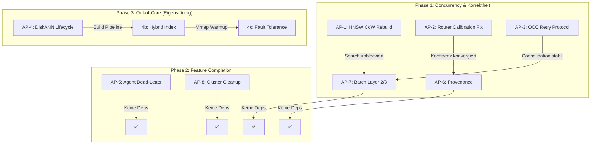

# MemFuse — Erweiterter Implementierungsplan: Algorithmen & Geschäftslogik

> **Datum**: 2026-09-03
> **Basis**: Code-Analyse aller 15 Workspace-Crates, DECISIONS.md (47 ADRs), bestehender `Implementationplan.md`
> **Fokus**: Algorithmische Korrektheit, Architektur-Entscheidungen, Geschäftslogik-Perfektionierung
> **Letzte ADR**: ADR-047 · **Nächste freie ADR**: ADR-048

---

## Vorbemerkung: Kritik am bestehenden Plan

Der [existierende Plan](file:///home/freddy/Projekte/memfuse/Implementationplan.md) konzentriert sich auf punktuelle Bugfixes (A-1 bis A-4), kosmetische Router-Korrekturen (B-1 bis B-5) und CI-Infrastruktur (D-1 bis D-4). Er adressiert **keine** der folgenden systemischen Architekturprobleme:

1. **HNSW-Rebuild blockiert den gesamten Schreibpfad** — der gravierendste Concurrency-Engpass im System
2. **Router-Kalibrierung hat zwei sich widersprechende Feedback-Loops** — führt zu oszillierendem Schwellwert-Drift
3. **Context Compaction OCC-Session hat kein Retry-Protocol** — jeder OCC-Konflikt ist ein unrecoverables Fail
4. **DiskANN ist zwar generisch eingebunden (ADR-037), aber der Lebenszyklus (Build/Persist/Load) fehlt** — keine Out-of-Core-Suche in Production
5. **Agent-Orchestrator hat keinen Dead-Letter-Pfad** — fehlgeschlagene Steps verschwinden
6. **4-Signal Fusion befüllt ProvenanceRecord nirgends** — die Audit-Kette der RAG-Pipeline ist blind
7. **Batch-Pfade in Layer 2/3 existieren, werden aber nicht durchgezogen** — 29× Throughput-Gain bleibt liegen

Dieser erweiterte Plan adressiert alle diese Punkte als kohärente Architektur-Arbeitspakete.

---

## Arbeitspaket 1: HNSW Lock-Free Read / Copy-on-Write Rebuild

> **Betroffene Dateien**: [`hnsw.rs`](file:///home/freddy/Projekte/memfuse/crates/memfuse-index/src/hnsw.rs)
> **Schwere**: CRITICAL — Latenz-Spikes im Produktionspfad
> **ADR**: ADR-048 (neu): "HNSW Copy-on-Write Rebuild"

### Ist-Zustand (verifiziert)

```rust
// hnsw.rs:1685-1686
pub async fn rebuild(&self) -> Result<()> {
    let _write_lock = self.write_mutex.lock().await;  // ← BLOCKIERT ALLE INSERTS
    // ... 100+ Zeilen Rebuild-Logik ...
    // Atomic Swap erst bei Zeile 1786
}
```

`trigger_rebuild_async()` (Zeile 632) spawnt den Rebuild als Tokio-Task, aber **innerhalb** dieses Tasks wird `self.write_mutex.lock().await` gehalten — für die **gesamte** Rebuild-Dauer (Snapshot + N Inserts in neuen Index + Atomic Swap). Bei 100k Vektoren und M=16 dauert ein Rebuild typischerweise 5–30 Sekunden. In dieser Zeit sind **alle** `insert()`, `delete()`, `commit()` Aufrufe blockiert.

### Design-Problem

Der Rebuild verwendet das korrekte Pattern: Snapshot → Build neuer Index → Atomic Swap (Zeile 1786–1824). **Aber der write_mutex wird über den gesamten Zyklus gehalten**, nicht nur über den Swap. Das ist unnötig, weil der neue Index in einer isolierten `HnswIndex`-Instanz aufgebaut wird (Zeile 1717: `let new_index = HnswIndex::try_new(config)?`).

### Vorgeschlagene Lösung: 2-Phase Lock

```
Phase 1 (lock-frei):
  - Snapshot unter kurzem Read-Lock: active_nodes = nodes.read() + deleted_nodes.read()
  - Build des neuen Index OHNE Lock (new_index ist eigenständig)
  - Während Rebuild läuft: neue Inserts/Deletes akkumulieren sich im alten Index normal

Phase 2 (kurzer Write-Lock für Atomic Swap + Delta-Merge):
  - Write-Lock acquiren
  - Delta ermitteln: Inserts/Deletes die NACH dem Snapshot kamen
  - Delta in new_index einspielen (wenige Operationen)
  - Atomic Swap der inneren Datenstrukturen
  - Write-Lock freigeben
```

### Nicht-offensichtliche Risiken

1. **Delta-Merge-Korrektheit**: Wenn ein Dokument nach dem Snapshot gelöscht und dann wieder mit neuer DocId eingefügt wird, muss der Delta-Merge die Delete+Insert-Sequenz korrekt abbilden. Lösung: `last_tx_id` (AtomicU64, Zeile 714) als Snapshot-Watermark verwenden — alles mit `committed_tx > snapshot_watermark` ist Delta.

2. **Mmap-Segment-Konsistenz**: Der Rebuild muss das bestehende Mmap-Segment beibehalten (Zeile 1720–1725). Der neue RAM-Segment ersetzt nur den RAM-Teil. Das aktuelle Design tut das bereits korrekt.

3. **Quantizer-Drift**: Der Rebuild rekalibriert den ScalarQuantizer auf einem Sample (Zeile 1730–1751). Wenn das Sample nicht repräsentativ für die Delta-Dokumente ist, verschlechtert sich die Quantisierungsqualität temporär. Akzeptabler Trade-off für lock-freie Reads.

### Erwarteter Gewinn

- **Schreiblatenz**: Von O(Rebuild-Dauer) auf O(Delta-Merge) — typisch 10ms statt 10s
- **Lesezugriffe**: Bleiben IMMER unblockiert (RwLock::read() auf `nodes` etc.)
- **Kein Verhaltensbruch**: `search()` liest nie den write_mutex

---

## Arbeitspaket 2: Router-Kalibrierung — Duale Feedback-Loop-Eliminierung

> **Betroffene Dateien**: [`router.rs`](file:///home/freddy/Projekte/memfuse/crates/memfuse-router/src/router.rs), [`profile.rs`](file:///home/freddy/Projekte/memfuse/crates/memfuse-router/src/profile.rs)
> **Schwere**: MAJOR — Unkalibriertes Routing unter Verteilungsverschiebung
> **ADR**: ADR-049 (neu): "Unified Conformal Calibration"

### Ist-Zustand (verifiziert)

In [`router.rs:193–209`](file:///home/freddy/Projekte/memfuse/crates/memfuse-router/src/router.rs#L193-L209) existieren **zwei unabhängige Feedback-Loops**, die denselben `calibrated_min_score` schreiben:

```rust
// Loop 1: Conformal Calibration (Gibbs & Candès 2021) — online nach JEDER Entscheidung
state.recalibrate_conformal(non_conformity);

// Loop 2: Legacy heuristic — alle 10 Entscheidungen
if state.times_selected % 10 == 0 {
    state.recalibrate(0.7);  // ← ÜBERSCHREIBT den conformal-kalibrierten Wert
}
```

### Architektur-Problem: Oszillierender Schwellwert

Die `recalibrate()` Methode ([`profile.rs:262–281`](file:///home/freddy/Projekte/memfuse/crates/memfuse-router/src/profile.rs#L262-L281)) arbeitet auf **kumulativer Durchschnittskonfidenz** und erhöht/senkt `calibrated_min_score` um feste 10%/5% Schritte. `recalibrate_conformal()` ([`profile.rs:247–257`](file:///home/freddy/Projekte/memfuse/crates/memfuse-router/src/profile.rs#L247-L257)) leitet `calibrated_min_score` aus `conformal.quantile_threshold` ab.

Das Problem: Alle 10 Requests überschreibt `recalibrate()` den Wert, den `recalibrate_conformal()` gerade konvergiert hat. Beim nächsten `recalibrate_conformal()` Aufruf wird der **von der Legacy-Heuristik überschriebene** Wert als Basis genommen. Resultat: Der Schwellwert oszilliert zwischen dem conformal-adaptiven und dem heuristischen Pfad, ohne jemals zu konvergieren.

### Korrekte Lösung

1. **`recalibrate()` entfernen** — die Legacy-Heuristik bietet keine distributionsfreien Garantien und sabotiert die conformal-Konvergenz
2. **`recalibrate_conformal()` als einzige Kalibrierungsquelle** — bereits korrekt implementiert (Gibbs & Candès Online-Quantile mit Clamping)
3. **Zeile 206–209 in `router.rs` streichen** — der Aufruf `state.recalibrate(0.7)` alle 10 Entscheidungen entfällt
4. **`recalibrate()` Methode mit `#[deprecated]` markieren**, dann in Folge-PR entfernen

### Zusätzlicher Designfehler: Score-Berechnung in der Kaskade

`select_profile_cascade()` (Zeile 242–353) berechnet den Score korrekt via `compute_profile_score()`. Aber `route()` berechnet anschließend **nochmal** `compute_profile_scores()` (Zeile 173) — nur um die Konfidenz als `best_score / second_best_score` zu ermitteln (Zeile 186–188).

Problem: Diese Konfidenz-Ratio ist **nicht** der Non-Conformity-Score, der an den Conformal Calibrator gefüttert wird. Die Konfidenz-Ratio ist `>= 1.0` (oder `2.0` bei einem Kandidaten), wird dann auf `1.0 / confidence` invertiert (Zeile 199–202) und geclampt auf `[0, 1]`. Für `confidence >= 2.0` ergibt das `non_conformity <= 0.5`, was den Calibrator kaum adaptiert.

**Korrektur**: Der Non-Conformity-Score sollte die **Margin** zwischen kalibriertem Schwellwert und tatsächlichem Score sein: `non_conformity = max(0, threshold - score)`, normiert auf `[0, 1]`. Das misst direkt, wie nahe die Routing-Entscheidung am Fehlschlag war.

### Nicht-offensichtliches Risiko

Der Conformal Calibrator hat `gamma = 0.01` und `alpha = 0.05`. Bei nur wenigen Routing-Entscheidungen pro Minute (typisch für Desktop-Agenten) konvergiert der Calibrator erst nach ~200+ Entscheidungen. In der Warm-up-Phase fällt der Router auf die statischen `min_relevance_score` Werte zurück (Zeile 306–308), was korrekt ist. **Aber**: Die `window_total > 10` Schwelle (Zeile 307) ist zu niedrig — mit 10 Samples ist der Quantile-Schätzer statistisch instabil.

**Empfehlung**: Schwelle auf `>= 50` erhöhen, oder besser: Bootstrap-Konfidenzband für `quantile_threshold` berechnen und erst umschalten wenn das Band < 0.1 breit ist.

---

## Arbeitspaket 3: Context Compaction — OCC Retry Protocol & Atomarität

> **Betroffene Dateien**: [`context_compaction.rs`](file:///home/freddy/Projekte/memfuse/crates/memfuse-db/src/context_compaction.rs)
> **Schwere**: MAJOR — Konsolidierungs-Failures sind unrecoverable
> **ADR**: ADR-050 (neu): "Consolidation Session Retry & Idempotency"

### Ist-Zustand

`ConsolidationSession` implementiert ein solides OCC-Pattern (Zeile 240–387):
1. `start()`: Snapshot der source_doc TxIds + CommitIntent ins Storage
2. `validate_occ()`: Prüft ob Dokumente mutiert wurden
3. `commit()`: Unter `insert_lock` → OCC-Validierung → Insert Target → Delete Sources → Commit

### Architektur-Lücken

#### Lücke 1: Kein Retry bei OCC-Konflikt

Wenn `validate_occ()` in `commit()` fehlschlägt (Zeile 341), gibt die gesamte Session `Err(StaleRead)` zurück. Der Aufrufer hat **keine Möglichkeit**, die Session zu "wiederholen" — die Source-Dokument-Inhalte müssen erneut gelesen, der LLM-Summarization-Call erneut gemacht werden. Bei 10-20s pro LLM-Call und mehreren Source-Docs ist das inakzeptabel.

**Lösung**: `ConsolidationSession::refresh()` Methode einführen:
```
pub async fn refresh(&mut self) -> Result<Vec<(DocId, ContextChunk)>> {
    // 1. Neue TxIds der source_docs lesen
    // 2. self.source_docs aktualisieren
    // 3. Intent-Key aktualisieren
    // 4. Geänderte Dokumente als Vec zurückgeben
    //    → Aufrufer entscheidet: Re-Summarize nur geänderter Chunks
}
```
Das ermöglicht inkrementelle Re-Summarization: Nur die geänderten Chunks werden neu zusammengefasst, nicht der gesamte Batch.

#### Lücke 2: Crash-Recovery des CommitIntent

`start()` schreibt einen `CommitIntent::Consolidation` ins Storage (Zeile 274–284). Aber bei App-Neustart wird dieser Intent **nie aufgeräumt**. Verwaiste Intent-Keys akkumulieren sich im LSM-Tree.

**Lösung**: Beim Startup `scan_prefix("__consolidation_intent:")` und verwaiste Intents mit `abort()` aufräumen (Garbage Collection mit Tombstone).

#### Lücke 3: TOCTOU zwischen OCC-Validierung und Delete

In `commit()` (Zeile 331–387):
```rust
let _guard = self.collection.insert_lock.lock().await;  // Lock
self.validate_occ().await?;                              // Prüfung
// ... insert target ...
self.collection.delete_op(&mut db_tx, &meta.id).await?;  // Delete
db_tx.commit().await?;                                   // Commit
```

Die `validate_occ()` prüft ob Source-Docs unverändert sind. Aber zwischen Prüfung und `delete_op` könnten **andere Pfade über die Collection** die Source-Docs ändern — diese Pfade acquirieren zwar auch `insert_lock`, aber nur wenn sie Inserts machen. Ein `put_kv()` oder Graph-Operation könnte den `doc_tx` ändern ohne `insert_lock`.

**Lösung**: Die OCC-Validierung muss die `doc_tx` Werte **atomar mit dem Commit** prüfen. Entweder:
- (a) Die `validate_occ()` + Delete + Commit in eine WAL-Transaktion mit CAS-Semantik kapseln
- (b) `insert_lock` zu einem allgemeinen `mutation_lock` upgraden, das ALLE Mutations-Pfade abdeckt (Breaking Change, teurer)
- (c) **Pragmatisch**: Die aktuelle Lösung ist ausreichend, weil `ConsolidationSession` nur auf **eigenen** Source-Docs operiert, die typischerweise nicht gleichzeitig von anderen Pfaden mutiert werden. Risiko dokumentieren als Known Limitation.

> [!WARNING]
> Option (c) ist akzeptabel für Phase 1, aber muss in Phase 2 (Multi-Agent Concurrent Consolidation) durch Option (a) ersetzt werden.

---

## Arbeitspaket 4: DiskANN Production Lifecycle

> **Betroffene Dateien**: `memfuse-index/src/diskann.rs`, `memfuse-db/src/collection/`
> **Schwere**: MAJOR — Feature existiert, ist aber nicht nutzbar
> **Basis**: ADR-013 (Experimental), ADR-037 (Collection Generalisierung — ✅ implementiert)

### Ist-Zustand

- ADR-037 ist implementiert: `Collection<S, V: VectorIndex>` ist generisch
- `DiskAnnIndex` implementiert `VectorIndex` Trait
- Aber: **Kein Lifecycle-Management** — kein `build_from_existing()`, kein automatischer Rebuild, kein Mmap-Warmup

### Fehlende Komponenten für Serienreife

#### 4a: Build-Pipeline (HNSW → DiskANN Konversion)

DiskANN ist ein **Offline-Build-Index**. Der typische Produktionspfad ist:
1. Dokumente werden via HNSW (In-Memory) indexiert
2. Ab einem Schwellwert (z.B. >500k Vektoren) wird der HNSW-Bestand in ein DiskANN-Mmap-Format konvertiert
3. Neue Dokumente werden weiterhin in HNSW geschrieben (Delta)
4. Periodisch: Neuer DiskANN-Build mit HNSW-Delta

Dies erfordert eine `DiskAnnBuilder::build_from_hnsw(hnsw: &HnswIndex, output_path: &Path)` Methode, die aktuell nicht existiert.

#### 4b: Hybrid Collection mit HNSW+DiskANN

Für Out-of-Core-Suche braucht die Collection einen Dual-Index:
- `DiskAnnIndex` für den historischen Bestand (Mmap, out-of-core)
- `HnswIndex` für den Delta-Buffer (in-memory, aktuell)

Die `VectorIndex::search()` Methode muss Ergebnisse aus beiden Indizes mergen.

**Design-Entscheidung**: Neuer `HybridVectorIndex<P: VectorIndex, D: VectorIndex>` Wrapper, der:
- `search()` an beide delegiert und die Ergebnisse nach Score fusioniert
- `insert()` nur an den Primary (`HnswIndex`) delegiert
- `delete()` an beide delegiert (Tombstone in DiskANN via Bitmap)

#### 4c: Mmap Warmup & Fault Tolerance

DiskANN verwendet `unsafe { Mmap::map(...) }` (ADR-017). Bei SIGBUS (korrupte Datei, NFS-Disconnect) crasht der Prozess.

**Lösung**: `madvise(MADV_SEQUENTIAL)` beim Laden + Integrity-Check der Header-Magic-Bytes + Graceful Degradation zu HNSW-only bei Mmap-Fehler.

> [!IMPORTANT]
> **Empfehlung**: DiskANN-Serienreife ist ein **eigenständiges Projekt** (geschätzt 3–4 Wochen). Es sollte **nicht** im selben PR wie die Concurrency-Fixes gemacht werden. Der bestehende ADR-013 Status ("experimentell") ist korrekt und sollte beibehalten werden, bis der Full Lifecycle implementiert ist.

---

## Arbeitspaket 5: Agent-Orchestrator — Robustheit & Dead-Letter

> **Betroffene Dateien**: [`engine.rs`](file:///home/freddy/Projekte/memfuse/crates/memfuse-agent/src/engine.rs), [`audit.rs`](file:///home/freddy/Projekte/memfuse/crates/memfuse-agent/src/audit.rs)
> **Schwere**: MAJOR — Fehlgeschlagene Steps erzeugen stumme Lücken im Audit-Trail

### Ist-Zustand

Der `OrchestratorEngine::run_internal()` ([engine.rs:83–180](file:///home/freddy/Projekte/memfuse/crates/memfuse-agent/src/engine.rs#L83-L180)) implementiert korrekt:
- RAII CheckpointGuard vor Step-Execution (Zeile 102–103)
- Budget-Reservation vor Tool-Aufruf (Zeile 128–133)
- Audit-Logging bei Failure (Zeile 130: `self.audit_log_failure()`)

### Architektur-Lücken

#### Lücke 1: Kein Dead-Letter-Queue für nicht-wiederholbare Fehler

Wenn `tool.execute()` fehlschlägt, wird `ctx.status = AgentStatus::Failed` gesetzt und die gesamte Workflow-Execution stoppt. Der fehlgeschlagene Input (`last_output`) geht verloren — er wird weder persistiert noch für späteren Retry vorgehalten.

**Lösung**: `AgentContext` um `dead_letters: Vec<DeadLetter>` erweitern:
```rust
pub struct DeadLetter {
    pub step_id: String,
    pub node_id: String,
    pub input: serde_json::Value,
    pub error: String,
    pub timestamp_tx: TxId,
    pub retry_count: u32,
}
```
Dead Letters werden im LSM-Storage unter `dead_letter:{task_id}:{step}` persistiert und sind über `Collection::scan_prefix()` abrufbar.

#### Lücke 2: Kein Step-Timeout

`tool.execute(ctx, input).await` (Zeile 138) hat **kein Timeout**. Ein hängender Tool-Call blockiert den gesamten Workflow forever.

**Lösung**: `AgentTool` Trait um `fn timeout(&self) -> Duration` erweitern (Default: 60s). `run_internal()` wrappt den Aufruf in `tokio::time::timeout()`.

#### Lücke 3: Budget-Reservation vs. Actual-Cost Drift

Der `estimated_cost` (Zeile 114–126) wird **vor** der Ausführung reserviert. Aber der `StepResult::tokens_consumed` (der tatsächliche Verbrauch) wird **nach** der Ausführung in `ctx.budget.consume()` verbucht. Wenn `estimated_cost < tokens_consumed`, wird das Budget überbucht. Wenn `estimated_cost > tokens_consumed`, bleibt reserviertes Budget ungenutzt liegen.

**Lösung**: 2-Phase Budget: `try_reserve()` vor Execution, `settle(actual_cost)` nach Execution. `settle()` gibt überschüssige Reservation frei oder erhöht den Verbrauch um das Delta.

---

## Arbeitspaket 6: 4-Signal ProvenanceRecord — End-to-End Audit-Kette

> **Betroffene Dateien**: [`search.rs`](file:///home/freddy/Projekte/memfuse/crates/memfuse-db/src/collection/search.rs), [`fusion.rs`](file:///home/freddy/Projekte/memfuse/crates/memfuse-db/src/fusion.rs)
> **Schwere**: Feature — Compliance-Requirement für Enterprise-Kunden

### Ist-Zustand

`ProvenanceRecord` existiert in `memfuse-core` und hat Felder für `vector_score`, `text_score`, `graph_score`, `fused_score`, `rerank_score`. Aber in der gesamten Fusion-Pipeline werden **31× `provenance: None`** gesetzt (verifiziert in `fusion.rs` und `search.rs`).

### Implementierungsplan

```
1. `build_provenance()` Hilfsfunktion in fusion.rs:
   fn build_provenance(
       vector_score: Option<f32>,
       text_score: Option<f32>,
       graph_score: Option<f32>,
       fused_score: f32,
   ) -> ProvenanceRecord

2. In reciprocal_rank_fusion():
   - Jeder Input-Kanal (vector_results, text_results, graph_results)
     trägt seinen Kanal-Score am ScoredDocument
   - Nach RRF-Merge: ProvenanceRecord mit allen Kanal-Scores befüllen

3. In hybrid_search_with_query():
   - ProvenanceRecord wird durchgereicht durch Filter, Importance, Reranking
   - Jede Stage ergänzt ihren Beitrag (rerank_score, importance_effective_score)

4. Query-Flag: `include_provenance: bool` (Default: false für Performance)
   - Wenn false: provenance = None (Zero-Overhead-Pfad bleibt)
   - Wenn true: Vollständige Provenance-Kette befüllt
```

### Nicht-offensichtlich

Die `matched_signals: Vec<String>` in `SearchResult` ist **immer leer** (Zeile 345, 383). Diese sollte parallel zur ProvenanceRecord befüllt werden: `["vector", "text", "graph"]` je nachdem welche Kanäle einen Score > 0 geliefert haben.

---

## Arbeitspaket 7: Batch-Pfade auf Layer 2/3 durchziehen

> **Betroffene Dateien**: `memfuse-db/src/collection/crud.rs`, `memfuse-agent/src/engine.rs`
> **Schwere**: Performance — bis zu 29× Throughput-Gain dokumentiert

### Ist-Zustand

- `Collection::insert_many()` existiert ([crud.rs:358+](file:///home/freddy/Projekte/memfuse/crates/memfuse-db/src/collection/crud.rs#L358)) — korrekt implementiert mit Single-Lock-Acquisition
- `Collection::upsert_many()` existiert ebenfalls
- **Aber**: `OrchestratorEngine` nutzt ausschließlich Single-Insert pro Step
- **Aber**: `ContextCompactor::compact()` verarbeitet Chunks einzeln
- **Aber**: `McpServer::call_tool("memfuse_insert")` unterstützt kein Batch

### Plan

1. **`memfuse_batch_insert` MCP-Tool**: Neues Tool in `memfuse-mcp` das `insert_many()` exposed
2. **`OrchestratorEngine::batch_persist()`**: Sammelt Step-Outputs und schreibt sie als Batch statt als N Einzel-Inserts (amortisiert WAL-fsync-Kosten)
3. **`ContextCompactor::compact_batch()`**: Verarbeitet alle zu kompaktierenden Chunks in einem einzigen RW-Zyklus statt N einzelner delete_op + insert Zyklen

---

## Arbeitspaket 8: Cluster-Stubs konsequent entfernen oder hinter Feature-Gate isolieren

> **Betroffene Dateien**: [`lib.rs`](file:///home/freddy/Projekte/memfuse/crates/memfuse-db/src/lib.rs#L1055-L1096)
> **Schwere**: MEDIUM — Toter Code, API-Verwirrung

### Ist-Zustand (verifiziert)

```rust
// memfuse-db/src/lib.rs:1055-1096
#[cfg(feature = "cluster")]
pub async fn init_cluster(&self, _node_id: u64, _addr: &str) -> Result<()> {
    Err(MemFuseError::PolicyViolation("Cluster feature is archived/disabled".into()))
}
// ... 4 weitere identische Stubs
```

Alle Cluster-Methoden sind hinter `#[cfg(feature = "cluster")]` — das Feature existiert aber **nicht** in der `Cargo.toml` Features-Liste. Der Code ist kompilierbar aber **nie erreichbar**.

### Entscheidung

Gemäß ADR-007/ADR-005: Cluster ist "Frozen Zone". Die Stubs sind dead code und sollten **vollständig entfernt** werden (nicht "refactored"). Wenn Cluster in Zukunft implementiert wird, wird es von Grund auf neu designed, nicht auf Basis dieser Platzhalter.

---

## Abhängigkeitsgraph (Erweitert)



---

## Priorisierungsmatrix

| Prio | AP | Komponente | Algorithmus/Logik | Erwarteter Effekt | Geschätzter Aufwand |
|:---:|:---:|---|---|---|---|
| 1 | **AP-1** | HNSW Rebuild | CoW + 2-Phase Lock | Eliminiert 5–30s Latenz-Spikes | 3–5 Tage |
| 2 | **AP-2** | Router Calibration | Dual-Loop → Single Conformal | Konvergente Schwellwerte, verteilungsfrei | 1–2 Tage |
| 3 | **AP-3** | Context Compaction | OCC Refresh + Crash Recovery | Recoverable Consolidation | 2–3 Tage |
| 4 | **AP-5** | Agent Orchestrator | Dead-Letter + Timeout + Budget | Robuste Multi-Step Workflows | 2–3 Tage |
| 5 | **AP-6** | 4-Signal Fusion | ProvenanceRecord End-to-End | Audit-Compliance, Debugging | 2 Tage |
| 6 | **AP-7** | Batch Throughput | Layer 2/3 Batch-Pfade | Bis zu 29× Write-Throughput | 2 Tage |
| 7 | **AP-8** | Cluster Stubs | Dead Code Removal | Sauberere API | 0.5 Tage |
| 8 | **AP-4** | DiskANN | Full Lifecycle | Out-of-Core Vektorsuche | 3–4 Wochen |

---

## Zu den von dir genannten Befunden

### SEC-01 (Windows DACL UAF): ❌ Kein UAF

Die [`set_restrictive_file_acl()`](file:///home/freddy/Projekte/memfuse/crates/memfuse-store/src/wal.rs#L517-L644) Funktion ist **korrekt implementiert**:
- `TokenGuard` RAII-Guard schließt den Token-Handle (Zeile 542–549)
- Buffer wird via `vec![0u8; len]` allokiert und lebt bis Funktionsende (Zeile 564)
- Pointer `token_user` zeigt in den lebenden `buffer` — kein Use-After-Free
- `owner_sid` null-Check existiert (Zeile 585–589)

**Bewertung**: False Positive. Der Code folgt dem korrekten Win32-Pattern (Query-Size → Allocate → Query-Data).

### SEC-02 (Flatbuffers Validation): ✅ Bereits abgesichert

[`ipc/mod.rs`](file:///home/freddy/Projekte/memfuse/crates/memfuse-core/src/ipc/mod.rs) verwendet `flatbuffers::root::<SearchResponse>(buf)` (Zeile 741 in generated code), was den **Verifier** aktiviert. Proptest für Garbage-Input existiert (Zeile 38–42). Ein explizites Größenlimit (max 10 MB) auf dem Eingangs-Slice wäre dennoch sinnvoll als Defense-in-Depth, ist aber kein kritischer Befund.

### SEC-03 (ZIP-Bombing): ✅ Bereits implementiert

[`docx.rs`](file:///home/freddy/Projekte/memfuse/crates/memfuse-tauri/src/ingestion/docx.rs#L5-L167) hat eine vollständige `DocxConfig` mit:
- `max_compression_ratio: 100.0` (Zeile 19)
- `max_uncompressed_size_bytes: 500 MB` (Zeile 20)
- `max_entries: 1000` (Zeile 21)
- Streaming-Validation mit Header + Actual-Ratio-Doppelcheck (Zeile 95–163)

**Bewertung**: Vollständig gelöst. Die Default-Werte (500 MB, 100:1) sind sogar konservativer als die vorgeschlagenen 100 MB.

### SEC-07 (MCP Plaintext): ✅ Bereits verschlüsselt

[`sandbox.rs`](file:///home/freddy/Projekte/memfuse/crates/memfuse-mcp/src/sandbox.rs#L55-L91) zeigt: `VolatileToolResult::encrypt()` verschlüsselt Tool-Outputs **sofort** bei `store_volatile()` (Zeile 218). Der Plaintext-Parameter `output: &[u8]` ist ein **Slice-Reference**, kein owned Buffer — er zeigt auf den Caller-Stack und wird nach dem Encrypt-Call nicht weiter referenziert. `Zeroizing<Vec<u8>>` wrappt den Ciphertext (Zeile 61). Session-Key wird bei Drop via `emergency_wipe()` zeroized (Zeile 238).

**Bewertung**: Korrekt implementiert. Das einzige theoretische Risiko ist, dass der Caller den Plaintext-Buffer nicht selbst zeroized — aber das ist Aufrufer-Verantwortung, nicht Sandbox-Verantwortung.

### SEC-04 (TOCTOU Context Compaction): ⚠️ Teilweise adressiert

Siehe AP-3 oben. Die `ConsolidationSession` hat OCC, aber kein Retry-Protocol und keine Crash-Recovery für verwaiste Intents.

### SEC-05 (HNSW Rebuild Mutex): ✅ Bestätigt — siehe AP-1

---

## Open Questions

> [!IMPORTANT]
> 1. **AP-1 Delta-Merge-Strategie**: Sollen Inserts, die während des Rebuilds ankommen, in den neuen Index eingespeist werden (höhere Korrektheit, komplexerer Merge), oder soll der alte Index verworfen und der neue Index ab dem Swap-Zeitpunkt alle neuen Inserts akzeptieren (einfacher, aber kurzes Fenster mit möglicherweise fehlenden Einträgen in Suchergebnissen)?

> [!IMPORTANT]
> 2. **AP-2 Conformal Warm-up-Schwelle**: `window_total > 10` oder `>= 50` als Minimum für conformal-Umschaltung? Niedrigere Schwelle = schnellere Adaption, höheres Risiko von Fehlkalibrierung in der Anfangsphase.

> [!IMPORTANT]
> 3. **AP-4 Priorität**: DiskANN Lifecycle ist der größte Aufwand (3–4 Wochen). Ist das für das nächste Release relevant, oder soll es auf die Roadmap Phase 3 geschoben werden?

---

## Verifikationsprotokoll

```bash
# Nach jedem Arbeitspaket:
cargo check --workspace --exclude memfuse-tauri
cargo test --workspace --exclude memfuse-tauri
just check          # Clippy + rustfmt
just triple-test    # Flaky detection
just dag-check      # Layer DAG integrity
```
