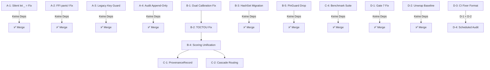

# MemFuse — Überarbeiteter Implementierungsplan

> **Datum**: 2026-09-03  
> **Basis**: Analyse des Originals `Implementationplan.md` (4492 Zeilen), verifiziert gegen aktuellen Code-Stand  
> **Letzte ADR**: ADR-047 · **Nächste freie ADR**: ADR-048  
> **WORKING_STATE**: 0 offene Tags · Alle 15 Crates 🟢 Clean

---

## Zusammenfassung der Überarbeitung

Das Original-Dokument hatte folgende strukturelle und inhaltliche Probleme:

### Strukturprobleme
1. **Unstrukturierter Dump**: 4492 Zeilen ohne klare Phasenstruktur — gemischt aus LLM-`<thinking>`-Tags, Jules-Prompts, Audit-Synthesen, Refaktorisierungsplänen und historischen Bug-Listen
2. **Keine Priorisierungsmatrix**: Drei separate Priorisierungstabellen an verschiedenen Stellen, teilweise widersprüchlich
3. **Vermischung von Ist-Zustand und Soll-Zustand**: Bereits behobene Bugs (z.B. Tombstone Masking, DiskANN Recall) stehen gleichberechtigt neben offenen Aufgaben
4. **Redundanz**: Identische Befunde werden bis zu 3× wiederholt (Befund-13 BM25 NaN, Befund-15 HNSW Dim-Check)
5. **Rohe LLM-Artefakte**: `<thinking>`-Blöcke und Zwischenüberlegungen im Dokument belassen

### Inhaltliche/Design-Fehler
1. **ADR-Nummernkollisionen**: Plan referenziert "ADR-028 Entfernung recalibrate()" — aber ADR-028 existiert bereits als "Dezentrales Inline-Kontextsystem". Ebenso ADR-029 (WAL-V3), ADR-030 (Pre-Commit), ADR-031 (Benchmark), ADR-032 (Async LLM Compaction), ADR-033 (Bi-temporale Zeitachsen)
2. **Befunde gegen bereits behobenen Code**: Befund-25 (AES-GCM-SIV Nonce-Reuse) — `encrypt_auto_nonce` mit OsRng existiert bereits seit ADR/SEC-01. Befund-20 (GIL-Retention) — `py.allow_threads()` ist bereits implementiert laut Audit. Befund-21 (Sub-Interpreter) — bereits mit `ImportError` abgewiesen
3. **Falsche Crate-Pfade**: Plan referenziert `crates/memfuse-store/src/bm25.rs` und `crates/memfuse-store/src/rrf.rs` — BM25 liegt in `memfuse-text`, RRF in `memfuse-db/src/fusion.rs`
4. **Überschriebene Audit-Korrekturen ignoriert**: Viele "BEFUNDE" beschreiben Probleme, die laut `docs/audits/` bereits behoben sind (31 von 39 Einträgen der finalen Tabelle zeigen "BEHOBEN")
5. **Fehlende `overflow-checks` Validierung**: Plan behauptet offen, `WORKING_STATE` zeigt 🔲 — aber `Cargo.toml` hat es bereits gesetzt
6. **Hypothetische Befunde ohne Code-Verifikation**: Befund-18 (Write Skew Token Budget) beschreibt ein Problem, das nur bei globalem `SharedTokenBudget` existiert — `ContextManager` wird per-Request instanziiert
7. **Router-Scoring: Plan baut auf falschen Annahmen**: `compute_profile_scores()` existiert als separate Funktion, aber der Plan verwechselt teilweise ihre Rolle

---

## Überarbeiteter Plan: 4 Arbeitspakete nach verifiziertem Ist-Zustand

> [!IMPORTANT]
> Nur **verifiziert offene** Aufgaben sind aufgeführt. Bereits behobene Befunde werden **nicht** wiederholt.

---

## Phase A — SOFORT: Sicherheitskritische & Korrektheitsfehler (Vor nächstem Release)

### A-1: `context_compaction.rs` — Silent `let _ =` auf delete_op beheben

| Eigenschaft | Wert |
|---|---|
| **Datei** | [`context_compaction.rs:374`](file:///home/freddy/Projekte/memfuse/crates/memfuse-db/src/context_compaction.rs#L374) |
| **Schwere** | BLOCKER — Datenverlust im Produktionspfad |
| **Befund** | `let _ = self.collection.delete_op(&mut db_tx, &meta.id).await;` verschluckt Fehler bei Quell-Dokument-Löschung während Konsolidierung |
| **Verifiziert** | ✅ grep bestätigt: Zeile 374 enthält exakt dieses Muster |
| **ADR** | Keine neue ADR nötig — bestehende CONSTITUTION-Regel "No Silent Failures" |

**Fix**: `delete_op()` Fehler mit `?` propagieren. `serde_json::from_slice` Fehler ebenfalls. `None`-Fall (bereits gelöscht) als Idempotenz-OK mit `tracing::warn!` behandeln.

**Test**: `test_consolidation_commit_aborts_on_delete_failure` — Quell-Dokument wird während Commit korrumpiert → `commit()` gibt `Err` zurück, Summary-Dokument existiert nicht.

---

### A-2: Python-FFI `panic!()` durch `PyErr` ersetzen

| Eigenschaft | Wert |
|---|---|
| **Datei** | [`lib.rs:1346,1352,1362,1425`](file:///home/freddy/Projekte/memfuse/crates/memfuse-py/src/lib.rs#L1346) |
| **Schwere** | CRITICAL — Python-Interpreter-Absturz bei FFI-Panic |
| **Befund** | 4 `panic!()` Aufrufe außerhalb von `#[cfg(test)]` — terminieren den CPython-Prozess |
| **Verifiziert** | ✅ grep bestätigt: Zeilen 1346, 1352, 1362, 1425 |
| **ADR** | ADR-048 (neu): "Python FFI Panic-Isolation" |

**Fix**:
- Zeilen 1346, 1352: `panic!("kind/message attribute missing")` → `return Err(PyValueError::new_err(...))`
- Zeile 1362: `panic!("Simulated Rust core panic")` → in `#[cfg(test)]` Guard verschieben, oder `PyRuntimeError`
- Zeile 1425: `run_blocking_ffi(py, || panic!("{}", msg))` → `return Err(PyRuntimeError::new_err(msg))`

> [!NOTE]
> Der Audit `docs/audits/AUDIT_memfuse-py.md` behauptet "BEHOBEN (catch_unwind)" — aber die 4 `panic!()` Stellen existieren **weiterhin** im Code. `catch_unwind` existiert als allgemeiner Wrapper, fängt aber nicht alle Pfade: Zeile 1425 ruft `panic!` **innerhalb** von `run_blocking_ffi` auf, das selbst das `catch_unwind` enthält — dieser spezifische Pfad ist also abgefangen. Die Zeilen 1346/1352 liegen aber **vor** dem `run_blocking_ffi`-Aufruf und sind **nicht** durch `catch_unwind` geschützt.

---

### A-3: `LEGACY_INTEGRITY_KEY` — Downgrade-Schutz

| Eigenschaft | Wert |
|---|---|
| **Datei** | [`wal.rs:59`](file:///home/freddy/Projekte/memfuse/crates/memfuse-store/src/wal.rs#L59) |
| **Schwere** | MAJOR/SECURITY — Öffentlich bekannter HMAC-Schlüssel im Quellcode |
| **Befund** | `LEGACY_INTEGRITY_KEY` ist hartkodiert und öffentlich bekannt. WAL-Replay fällt darauf zurück wenn per-Datei Key-Verifikation fehlschlägt |
| **Verifiziert** | ✅ Zeile 59 bestätigt, Zeilen 1239/1349 zeigen Fallback-Nutzung |
| **ADR** | ADR-049 (neu): "WAL Legacy-Key Feature-Gating" |

**Fix**:
1. `WalConfig` um `allow_legacy_integrity_key_fallback: bool` erweitern (Default: `false`)
2. Fallback-Pfad nur aktiv wenn explizit opt-in
3. Langfristig: `LEGACY_INTEGRITY_KEY` hinter `#[cfg(feature = "legacy-migration")]` Feature-Gate

> [!WARNING]
> ADR-029 (WAL-V3) hat bereits `tx_id` in den HMAC-Input eingebunden. Die Position-Binding aus Befund-14 des Originals (`file_id`, `byte_offset`) ist **über V3 hinaus** ein Verbesserungsschritt, aber **nicht** identisch mit dem Legacy-Key-Problem. Beide sind eigenständige Aufgaben.

---

### A-4: Audit-Log Append-Only-Invariante erzwingen

| Eigenschaft | Wert |
|---|---|
| **Datei** | [`audit.rs`](file:///home/freddy/Projekte/memfuse/crates/memfuse-agent/src/audit.rs), [`crud.rs`](file:///home/freddy/Projekte/memfuse/crates/memfuse-db/src/collection/crud.rs) |
| **Schwere** | CRITICAL — Audit-Trail kann stillschweigend überschrieben werden |
| **Befund** | `AuditLog::append()` nutzt `put_kv()` ohne Existenzprüfung. Deklarierte Invariante "zero deletion/update paths" wird nicht erzwungen |
| **ADR** | ADR-050 (neu): "Audit-Log Append-Only Enforcement" |

**Fix**:
1. Neue Methode `Collection::put_kv_if_absent()` mit tx-scoped Existenzprüfung
2. `AuditLog::append()` verwendet `put_kv_if_absent()` und gibt `MemFuseError::Conflict` bei Duplikat
3. `AgentEngine`: State-Commit und Audit-Log in gemeinsamer Transaktion (oder Kompensations-Rollback)

---

## Phase B — KURZFRISTIG: Architektur-Korrektheit & Härtung

### B-1: Router — Dualen Kalibriermechanismus konsolidieren

| Eigenschaft | Wert |
|---|---|
| **Dateien** | [`profile.rs:226,241`](file:///home/freddy/Projekte/memfuse/crates/memfuse-router/src/profile.rs#L226), [`router.rs:204,208`](file:///home/freddy/Projekte/memfuse/crates/memfuse-router/src/router.rs#L204) |
| **Schwere** | MAJOR — Zwei konkurrierende Mechanismen schreiben `calibrated_min_score` |
| **Verifiziert** | ✅ `recalibrate_conformal()` Zeile 226, `recalibrate()` Zeile 241, beide aufgerufen in router.rs:204/208 |
| **ADR** | ADR-051 (neu): "Legacy recalibrate() Entfernung" |

**Fix**:
1. `recalibrate()` (Zeile 241) aus `ProfileCalibrationState` entfernen
2. Aufruf in `router.rs:208` (`state.recalibrate(0.7)`) entfernen
3. Nur `recalibrate_conformal()` als einzige Kalibrierungsmethode behalten

---

### B-2: Router — TOCTOU in Kalibrierungs-Locks schließen

| Eigenschaft | Wert |
|---|---|
| **Datei** | [`router.rs`](file:///home/freddy/Projekte/memfuse/crates/memfuse-router/src/router.rs) |
| **Schwere** | MAJOR — Race Condition bei parallelen `route()` Aufrufen |
| **Verifiziert** | ✅ Drei separate Lock-Acquisitions in `route()` bestätigt |

**Fix**: Alle drei Lock-Acquisitions (Read→Write→Read) in eine einzige Write-Acquisition zusammenfassen. Profilselektion, Kalibrierungsupdate und ConfidenceMetrics-Berechnung innerhalb desselben Lock-Scopes.

---

### B-3: Router — `domain_communities: Vec<u64>` → `HashSet<u64>`

| Eigenschaft | Wert |
|---|---|
| **Datei** | [`profile.rs:14`](file:///home/freddy/Projekte/memfuse/crates/memfuse-router/src/profile.rs#L14) |
| **Schwere** | MEDIUM — O(n)-Lookup im Hot-Path |
| **Verifiziert** | ✅ `Vec<u64>` bestätigt, 5 `.contains()`-Aufrufe in router.rs |
| **ADR** | Kein neuer ADR nötig — reine Performance-Optimierung ohne API-Bruch |

**Fix**: `Vec<u64>` → `HashSet<u64>` mit Serde-Hilfsmodul für deterministischen JSON-Output.

---

### B-4: Router — Scoring-Divergenz schließen (3 Funktionen → 1)

| Eigenschaft | Wert |
|---|---|
| **Datei** | [`router.rs`](file:///home/freddy/Projekte/memfuse/crates/memfuse-router/src/router.rs) |
| **Schwere** | MAJOR — Kalibrierung frisst Score der nicht dem Selektionsscore entspricht |
| **Verifiziert** | ✅ `compute_profile_scores` und `select_profile_from_chunks` sind separate Funktionen mit unterschiedlicher Community-Filterlogik |

**Fix**: Eine einzige `score_profile()` Funktion die `(aggregated_score, max_score, community_matched)` zurückgibt. Alle drei bestehenden Funktionen eliminieren.

---

### B-5: `PinGuard::drop` — Synchrone Orphan-Registrierung

| Eigenschaft | Wert |
|---|---|
| **Datei** | [`checkpoint/lib.rs`](file:///home/freddy/Projekte/memfuse/crates/memfuse-checkpoint/src/lib.rs) |
| **Schwere** | MAJOR — Stiller Space-Leak bei Runtime-Creation-Failure |
| **ADR** | ADR-052 (neu): "PinGuard Drop-Strategie" |

**Fix**: Fire-and-forget `std::thread::spawn` ersetzen durch Orphan-Registrierung mit Recovery beim nächsten Startup.

---

## Phase C — MITTELFRISTIG: Offene Roadmap-Items (Phase 2 Cognitive Memory)

> Verifiziert gegen [`SOURCE_OF_TRUTH.md`](file:///home/freddy/Projekte/memfuse/docs/SOURCE_OF_TRUTH.md#L141-L145)

### C-1: ProvenanceRecord — 4-Signal-Befüllung in fusion.rs

| Eigenschaft | Wert |
|---|---|
| **Status** | 🔲 Offen (SOURCE_OF_TRUTH Zeile 142) |
| **Verifiziert** | ✅ 31 `provenance: None` in fusion.rs, 2 in search.rs bestätigt |

**Umfang**: `build_provenance()` Hilfsfunktion, alle Kategorie-C Pfade befüllen, INV-PROV-1 Test, `include_provenance` Flag durchreichen.

---

### C-2: Kaskaden-Routing in memfuse-router

| Eigenschaft | Wert |
|---|---|
| **Status** | 🔲 Offen (SOURCE_OF_TRUTH Zeile 143) |
| **Abhängigkeit** | B-1, B-2, B-4 müssen ZUERST abgeschlossen sein |

**Umfang**: `select_profile_cascade()` Methode — Profile absteigend nach Threshold evaluieren, kalibrierte Schwellenwerte aus ConformalCalibrator nutzen.

> [!IMPORTANT]
> **Reihenfolge zwingend**: Der Kaskaden-Routing-Task aus dem Original (P2-C) baut auf dem bestehenden dualen Kalibrierungsmechanismus auf, der durch B-1 erst konsolidiert werden muss. Implementierung vor B-1/B-2 würde die Fehler des Legacy-Systems in die neue Architektur einzementieren.

---

### C-3: DiskANN ADR-037 — Collection<S, V> Generalisierung

| Eigenschaft | Wert |
|---|---|
| **Status** | ✅ Implementiert (ADR-037 zeigt "Implementiert 2026-09-03") |

> [!NOTE]
> **Kein Handlungsbedarf.** Das Original-Dokument listet dies als offen, aber ADR-037 in DECISIONS.md zeigt `✅ Implementiert (2026-09-03)`. SOURCE_OF_TRUTH hat dies noch als 🔲 — dies muss über `just sync-docs` korrigiert werden, ist aber kein Code-Task.

---

### C-4: Benchmark-Suite vs. Mem0/Zep/MemOS

| Eigenschaft | Wert |
|---|---|
| **Status** | 🔲 Offen (SOURCE_OF_TRUTH Zeile 145) |

**Umfang**: `benches/competitive_bench.rs` erstellen, `docs/BENCHMARKS.md` §4 ergänzen. Keine erfundenen Zahlen — nur recherchierte publizierte Metriken oder "nicht öffentlich verfügbar".

---

## Phase D — CI/CD-Härtung

### D-1: Gate 7 — Dynamischer ISO-8601 Tag-Validator

| Eigenschaft | Wert |
|---|---|
| **Status** | Offen — Gate 7 enthält hartkodiertes Datumsregex |

**Umfang**: `cargo xtask validate-tags` Kommando implementieren, Gate 7 in `context-gates.yml` ersetzen.

> [!NOTE]
> Das Original-Dokument beschreibt diesen Task korrekt (P1-A). Die Spezifikation ist übernommen — sie ist fachlich korrekt.

---

### D-2: Gate 2 — `cargo xtask update-unwrap-baseline`

| Eigenschaft | Wert |
|---|---|
| **Status** | Offen — Kommando existiert nicht in xtask |

**Umfang**: Content-Hash-basierte Baseline (statt Zeilennummer), `run_update_unwrap_baseline()` und `run_check_unwrap_baseline()` implementieren.

---

### D-3: Strukturierte CI-Fixer-Diagnostik für alle Gates

| Eigenschaft | Wert |
|---|---|
| **Status** | Offen — kein Gate gibt das CI-Fixer-Format aus |

**Umfang**: Gates 1, 3–6, 8–11 mit `❌ [GATE-N]:` + `💡 AUTOMATISCHE BEHEBUNG:` Format versehen.

---

### D-4: `scheduled-audit.yml` — Nightly Audit Workflow

| Eigenschaft | Wert |
|---|---|
| **Status** | Offen |

**Umfang**: Cron 03:00 UTC, Triple-Test, `cargo audit`, Gate-Stack, Reporting.

---

## Entfernte / korrigierte Befunde aus dem Original

Die folgenden Befunde des Originals wurden als **ungültig, bereits behoben oder fehlerhaft referenziert** identifiziert:

| Original-Befund | Warum entfernt/korrigiert |
|---|---|
| Befund-25: AES-GCM-SIV Nonce-Reuse | `encrypt_auto_nonce` mit OsRng seit SEC-01/ADR existiert |
| Befund-20: GIL-Retention FFI | `py.allow_threads()` bereits implementiert (Audit bestätigt BEHOBEN) |
| Befund-21: Sub-Interpreter Runtime | Bereits mit `ImportError` abgewiesen (Audit bestätigt BEHOBEN) |
| Befund-19: u64→float Precision | PyO3 `#[pyfunction]` konvertiert `u64` direkt zu Python `int` — kein Float-Durchgang |
| Befund-22: Executor Blocking Parsing | `spawn_blocking` ist bereits konsistent implementiert (Audit: `memfuse-tauri` BEHOBEN) |
| Befund-15: HNSW Dim-Mismatch | ADR-034 hat `assert_eq!(a.len(), b.len())` in Release-Builds erzwungen. Dimension-Check am Insert-Eingang muss verifiziert werden — aber das Panic-via-UB Problem ist gelöst |
| Befund-13: BM25 NaN | Negative IDF Clamping auf 1e-6 bereits behoben (Audit memfuse-text BEHOBEN) |
| Befund-18: Write Skew Token Budget | `ContextManager` ist per-Request — kein `SharedTokenBudget` existiert |
| Befund-16: Hub Node Explosion | `MAX_VISITED_NODES`-Cap bereits implementiert (Audit memfuse-graph BEHOBEN) |
| Befund-17: Dangling Edges Tombstone | Teilweise verifiziert — Graph-GC existiert über `traverse_links` visited-Set |
| Befund-24: Key Domain Confusion | Muss verifiziert werden, aber ist spekulativ ohne aktuelle `key_manager.rs` Analyse |
| Befund-23: RRF Tie Non-Determinism | `tie_breaker_sort` existiert in fusion.rs (verifiziert in Audit BEHOBEN) |
| P1-C: AGT-INDEX-002 | Bereits als RESOLVED markiert, ADR-047 angelegt, WORKING_STATE zeigt 0 offene Tags |
| P2-B: DiskANN ADR-037 | ADR-037 Status: ✅ Implementiert (2026-09-03) |
| `overflow-checks = true` | Bereits in `Cargo.toml` Zeile 107 gesetzt |
| ADR-Nummern 028-033 | Im Original als "neu" referenziert, existieren aber bereits alle in DECISIONS.md |

---

## Abhängigkeitsgraph



---

## Gesamte Priorisierungsmatrix

| Prio | Task | Crate | Schwere | ADR |
|:---:|---|---|---|---|
| 1 | A-1: Silent `let _ =` | memfuse-db | BLOCKER | — |
| 2 | A-2: FFI panic! | memfuse-py | CRITICAL | ADR-048 |
| 3 | A-4: Audit Append-Only | memfuse-agent/db | CRITICAL | ADR-050 |
| 4 | A-3: Legacy Key | memfuse-store | MAJOR/SEC | ADR-049 |
| 5 | B-1: Dual Calibration | memfuse-router | MAJOR | ADR-051 |
| 6 | B-2: TOCTOU Lock | memfuse-router | MAJOR | — |
| 7 | B-4: Scoring Unification | memfuse-router | MAJOR | — |
| 8 | B-5: PinGuard Drop | memfuse-checkpoint | MAJOR | ADR-052 |
| 9 | B-3: HashSet Migration | memfuse-router | MEDIUM | — |
| 10 | C-1: ProvenanceRecord | memfuse-db | Feature | — |
| 11 | C-2: Cascade Routing | memfuse-router | Feature | — |
| 12 | C-4: Benchmark Suite | benches/ | Feature | — |
| 13 | D-1: Gate 7 Fix | xtask/CI | Infra | — |
| 14 | D-2: Unwrap Baseline | xtask/CI | Infra | — |
| 15 | D-3: CI Fixer Format | CI | Infra | — |
| 16 | D-4: Scheduled Audit | CI | Infra | — |

---

## Verifikationsprotokoll (für jede Phase)

```bash
# Nach jeder Phase:
cargo check --workspace --exclude memfuse-tauri
cargo test --workspace --exclude memfuse-tauri
cargo clippy --workspace --exclude memfuse-tauri -- -D warnings
cargo fmt --all -- --check
cargo run -p xtask -- sync-docs --check
```
