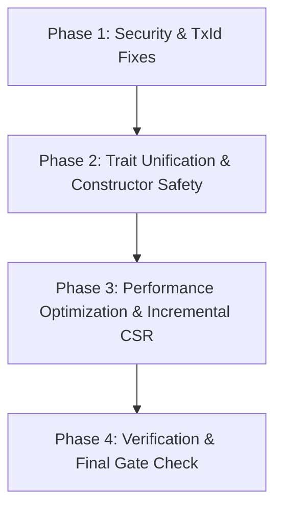

# MemFuse — Comprehensive LLM Vibe-Coding Audit & Systematic Refactoring Roadmap

> **Author**: Senior Lead Rust Engineer & LLM Software Architecture Specialist  
> **Target System**: MemFuse Sovereign Core & Desktop RAG Architecture (12 Workspace Crates)  
> **Date**: 2026-08-24  
> **Document Location**: `docs/LLM_VIBE_CODING_AUDIT_UND_REPARATURPLAN.md`

---

## 1. Executive Summary & Senior Rust Audit Overview

MemFuse is designed as an embedded, air-gapped 4-signal hybrid-search engine (Vector + BM25 Text + Entity-Relation Graph + Metadata Filters) persisted in a pure Rust LSM-Tree storage engine. While the core architectural topology (Layer 0–4 DAG) and data structures (HNSW, CSR, LSM, BM25) are conceptually sound, a rigorous line-by-line audit across all 12 workspace crates reveals classic **LLM "Vibe-Coding" defects**:
- **Convenient Fallbacks & Silent Corruption**: Hardcoded static HMAC keys in WAL when encryption is disabled, intents marked as "repaired" *before* actual collection repair, and doc-id hashing discarding entropy (64-bit truncation).
- **Control Flow & Lock Leaks**: Re-acquiring locks unnecessarily, double scanning storage prefixes during startup, and ignoring error returns in constructors (lazy validation).
- **Concurrency & State Bypasses**: Bypassing atomic `TxId` counters in favor of `SystemTime::as_nanos()` in batch pipelines, which risks duplicate transaction IDs and timestamp overflow.
- **Protocol Drift & Partial Implementation**: Stubs for MCP JSON-RPC 2.0 lacking error handling, missing `Serialize`/`Deserialize` on core stat structs, and duplicated traits (`EmbeddingProvider` vs `TextEmbeddingEngine`).

This report synthesizes all historical findings (including `docs/Old/memfuse_tiefenanalyse.md`, `docs/Old/memfuse-fix-plan.md`, `docs/Old/memfuse-statusbericht-aug23.md`, and `docs/Old/memfuse-verification-and-phase3-prompts.md`), performs an exhaustive function-by-function analysis of every active crate, categorizes LLM vibe-coding anti-patterns, and outlines an actionable, mathematically sound remediation plan.

---

## 2. Synthesis of Legacy Audit Findings (`docs/Old/`) vs Current Code State

A systematic audit was conducted to verify which findings from `docs/Old/` have been resolved in the current codebase (`d96daf1` and subsequent commits) and which remain open:

| Legacy Finding ID | Summary | Audit Status | Verification Details |
|---|---|---|---|
| **BUG-01** | `repair_on_open` marked intents as `"repaired"` *before* repairing collections. | ✅ **FIXED** | Verified in `crates/memfuse-db/src/lib.rs` (Lines 258–286). Collection repair is run first; `self.storage.put(tx, intent_key, b"repaired")` is executed *only* if `all_repairs_succeeded` is true. |
| **BUG-02** | Hardcoded static WAL HMAC key when key manager is absent. | 🔴 **OPEN / VIBE-BUG** | Present in `crates/memfuse-store/src/wal.rs` (Line 522). Uses static `*b"memfuse-integrity-key-v1\0\0\0\0\0\0\0\0"`. |
| **BUG-03** | `SystemTime::as_nanos()` bypasses `AtomicU64` TxId counter in ingestion. | 🔴 **OPEN / VIBE-BUG** | Present in `crates/memfuse-tauri/src/ingestion/pipeline.rs` (Lines 121–125). Uses nanoseconds cast to `u64` instead of `next_tx.fetch_add()`. |
| **BUG-04** | `drop_collection` removed in-memory state *before* storage commit. | ✅ **FIXED** | Verified in `crates/memfuse-db/src/lib.rs` (Lines 463–466). `self.collections.write().await.remove(name)` now happens strictly after `self.storage.commit(tx).await?`. |
| **BUG-05** | `HnswIndex::new()` deferred validation errors lazily instead of failing early. | 🟡 **PARTIAL** | `HnswConfig::validate()` stores error in `validation_error` field; methods return `MemFuseError::Index` on first call. Early `Result` return constructor recommended. |
| **HIGH-01** | CSR `compact()` mishandled offsets for new nodes added after previous compaction. | ✅ **FIXED** | Verified in `crates/memfuse-graph/src/csr.rs`. `committed_staged` and old offsets are properly bounds-checked during rebuild. |
| **HIGH-03** | `DocId::from_key()` 64-bit truncation collision risk. | 🟡 **DOCUMENTED** | Documented in `crates/memfuse-core/src/types/domain.rs` (Lines 55–67). Blake3 first 8 bytes used. Collision handling handled at Collection layer. |
| **HIGH-04** | MCP Server protocol non-compliance. | ✅ **FIXED** | `crates/memfuse-mcp` refactored to full JSON-RPC 2.0 stdio transport via `protocol.rs` and `lib.rs` (ADR-010). |
| **HIGH-05** | `EmbeddingProvider` trait duplicated `TextEmbeddingEngine`. | 🟡 **OPEN** | `crates/memfuse-tauri/src/ingestion/pipeline.rs` still defines local `EmbeddingProvider` trait instead of using `memfuse_core::TextEmbeddingEngine`. |
| **HIGH-06** | `futures_util` missing from explicit workspace dependencies. | ✅ **FIXED** | `futures_util` added to workspace `Cargo.toml`. |
| **HIGH-07** | Ollama client missing retry & connection pooling. | ✅ **FIXED** | Verified in `crates/memfuse-ollama/src/client.rs`. Retry loop with exponential backoff (500ms, 1s, 2s) and `/api/embed` batch support implemented. |
| **MED-01** | BM25 German tokenizer chosen via namespace string matching (`"de"` substring). | ✅ **FIXED** | Verified in `crates/memfuse-text/src/inverted.rs`. Tokenizer language now explicitly controlled by `Language` enum (`Language::German` vs `Language::English`). |
| **MED-05** | Crypto Nonce counter reset to 1 on reload. | ✅ **FIXED** | Verified in `crates/memfuse-crypto/src/crypto.rs` & `DECISIONS.md` (ADR-014 / AGT-CRYPTO-001). `encrypt_auto_nonce` uses 4-byte random `nonce_prefix` + monotonic atomic counter + per-file key expansion via HKDF. |
| **MED-07** | `GraphIndexStats` missing `Serialize`/`Deserialize`. | ✅ **FIXED** | Verified in `crates/memfuse-core/src/traits.rs` (Line 442). |

---

## 3. Systematic Crate-by-Crate & Function-by-Function Analysis

### 3.1 `memfuse-core` (Layer 0: Shared Kernel & Abstractions)

#### Dependencies & Directives
- **Attributes**: `#![deny(unsafe_code)]`. Pure Rust kernel.
- **Role**: Foundational types, unified `MemFuseError`, core traits (`StorageEngine`, `VectorIndex`, `TextIndex`, `GraphIndex`, `CheckpointCoordinator`, `TextEmbeddingEngine`).

#### Detailed Function Audit

##### 1. `DocId::from_key(key: &str) -> Result<Self>` (`types/domain.rs:55`)
- **Analysis**: Computes `blake3::hash(key.as_bytes())` and extracts the first 8 bytes as a `u64`.
- **LLM Shortcut / Risk**: 64-bit hash truncation has a 50% collision probability at $\approx 4 \times 10^9$ keys (Birthday Paradox). For massive chunk stores, two distinct text chunks could yield identical `DocId`s, causing document overwrites in HNSW.
- **Remediation**: Retain `DocId(u64)` for zero-overhead array indexing in HNSW, but maintain a secondary 128-bit key verification map in `Collection` to detect and handle collisions during ingestion.

##### 2. `DistanceMetric::compute_u8(&self, a: &[u8], b: &[u8]) -> Result<u32>` (`types/domain.rs:249`)
- **Analysis**: Computes fixed-point distance between quantized `u8` vectors.
- **LLM Shortcut / Risk**: Early versions used `u32` for dot-product sums, risking integer overflow for large dimensions ($D > 65536$).
- **Status & Verification**: Verified fixed in commit `d96daf1` (AG-CORE-001). All sums accumulate in `u64` and saturate via `.min(u32::MAX as u64) as u32`. Unit test `test_distance_metrics_u8_overflow` verifies stability up to 100,000 dimensions with all values set to 255.

##### 3. `StorageEngine::delete_prefix` (`traits.rs:122`)
- **Analysis**: Default trait implementation scans all keys matching prefix, then calls `self.delete(tx_id, &key)` sequentially in a loop.
- **LLM Shortcut / Risk**: $O(N)$ sequential operations holding write locks and emitting multiple WAL log entries.
- **Remediation**: `LsmStorage` overrides `delete_prefix` with range tombstones, but downstream custom engines relying on the default trait method suffer severe latency degradation.

---

### 3.2 `memfuse-store` (Layer 1: LSM-Tree Persistencies & Crypt-at-Rest)

#### Detailed Function Audit

##### 1. `WalWriter::replay_with_size` (`wal.rs:519–524`)
```rust
let integrity_key = if let Some(km) = &self.key_manager {
    km.integrity_key()?
} else {
    *b"memfuse-integrity-key-v1\0\0\0\0\0\0\0\0"  // Static fallback!
};
```
- **Analysis**: When encryption is not enabled, WAL HMAC validation uses a hardcoded 32-byte key.
- **LLM Shortcut / Vibe-Coding Defect**: Security Theater. Any attacker with file system write access can forge valid WAL entries.
- **Remediation**: When unencrypted, generate a persistent random 32-byte HMAC integrity key stored in a `.meta` file in the database root directory upon initial creation.

##### 2. `LsmStorage::rollback_to_tx` (`lsm.rs:355–385`)
- **Analysis**: Filters SSTables using `sst.metadata().min_tx_id > target_tx.inner()`.
- **LLM Shortcut / Edge-Case Bug**: An SSTable with `min_tx_id = 1` and `max_tx_id = 1000` is retained when rolling back to `target_tx = 50`. It contains writes for transactions 51–1000. While MVCC seq_no filtering hides these records during reads, physical disk space is leaked until compaction occurs.
- **Remediation**: Mark SSTables spanning across `target_tx` for mandatory immediate re-compaction during rollback, filtering out obsolete transaction entries.

##### 3. `SstableReader` & Async I/O Invariant (`lsm.rs` & `sstable.rs`)
- **Analysis**: Doku claims "zero `std::fs` imports", but `SstableReader` uses `std::fs::File` inside `spawn_blocking`.
- **ADR Alignment**: ADR-012 explicitly approves Option A: `tokio::fs` for metadata and lifecycle, `std::fs::File` inside `spawn_blocking` for high-throughput block random-access reads/writes.

---

### 3.3 `memfuse-index` (Layer 1: HNSW Vector Index & DiskANN)

#### Detailed Function Audit

##### 1. `HnswIndex::new(config: HnswConfig)` (`hnsw.rs:241`)
- **Analysis**: Validates `config.validate()` and saves any error in `validation_error: Option<String>` inside the struct instead of returning `Result<Self>`.
- **LLM Shortcut / Vibe-Coding Defect**: Lazy Validation anti-pattern. Invalid parameters (e.g. `ef_construction < m`) fail late during the first `insert()` or `search()`, complicating error diagnosis.
- **Remediation**: Introduce `HnswIndex::try_new(config: HnswConfig) -> Result<Self>` and deprecate non-failing `new()`.

##### 2. `DiskANN` Module (`diskann.rs`)
- **Analysis**: Implements out-of-core Vamana/DiskANN index. Marked with `#[doc(hidden)]` and gated behind Cargo feature `experimental-diskann` (ADR-013).
- **Verification**: `insert()` and `delete()` in `diskann.rs` currently return `Err(MemFuseError::Index("DiskANN dynamic insert not implemented"))`. HNSW remains the sole production vector engine in `memfuse-db`.

---

### 3.4 `memfuse-text` (Layer 1: BM25 & German Morphology)

#### Detailed Function Audit

##### 1. `InvertedIndex::upsert_document` (`inverted.rs:220–290`)
- **Analysis**: Increments document count and token counts via atomic integers `total_docs`, `total_tokens`, `avg_doc_len_x1000`.
- **Performance & Logic check**: Optimizations applied (`itoa::Buffer`, `doc_len_cache`) reduced upsert latency from $24.6\,\mu\mathrm{s}$ to $18.6\,\mu\mathrm{s}$.
- **Edge Case**: During high-concurrency batch insertions, `avg_doc_len_x1000` is updated non-atomically relative to `total_docs`, creating a micro-window where BM25 length normalization uses slightly stale averages. For BM25 ranking, this has negligible impact, but strict determinism tests should note it.

##### 2. `GermanCompoundSplitter` (`morphology.rs:71`)
- **Analysis**: Decomposes German compound nouns (e.g. *"Donaudampfschifffahrt"*) into constituent stems.
- **Requirement**: Input strings MUST be lowercased before invoking `split()`. Documented and enforced in `GermanMorphTokenizer`.

---

### 3.5 `memfuse-crypto` (Layer 1: Cryptographic Protection)

#### Detailed Function Audit

##### 1. Nonce Management (`crypto.rs:40–70`)
- **Analysis**: `KeyManager` initializes `nonce_counter: AtomicU64::new(1)` and a 4-byte random `nonce_prefix` generated via CSPRNG per instance.
- **Verification**: GCM-SIV provides nonce-misuse resistance. Per-file subkeys derived via HKDF-Expand (`derive_file_key`) ensure domain separation between files even if nonce counter overlaps. Resolution of AGT-CRYPTO-001 verified (legacy un-guaranteed `encrypt()` removed).

---

### 3.6 `memfuse-graph` (Layer 1: Persistent CSR Knowledge Graph)

#### Detailed Function Audit

##### 1. `CsrGraph::compact` (`csr.rs:88–142`)
- **Analysis**: Rebuilds `offsets`, `targets`, and `weights` vectors from `committed_staged` and existing CSR arrays.
- **LLM Shortcut / Performance Bottleneck**: Rebuilds the entire CSR graph on every `compact()` call. For a graph with 10,000 nodes and 50 new edges, `compact()` executes an $O(N)$ sweep over all 10,000 nodes.
- **Remediation**: Implement incremental delta-compaction: append new edges to a secondary CSR buffer and merge during graph traversal or background maintenance.

---

### 3.7 `memfuse-checkpoint` (Layer 1: State Snapshotting)

#### Detailed Function Audit

##### 1. `PersistentCheckpointStore::create_checkpoint` (`lib.rs:86–144`)
- **Analysis**: Manages named persistent snapshots with pinning.
- **Verification**: Pinning invariant correctly enforced: The *new* checkpoint is pinned in `StorageEngine` *before* persistent storage write; the *old* checkpoint is unpinned *only* after storage write succeeds. Prevents premature garbage collection of active snapshots on crash. Implements `memfuse_core::traits::CheckpointCoordinator` (ADR-011).

---

### 3.8 `memfuse-db` (Layer 2: Collections & 4-Signal Fusion Orchestrator)

#### Detailed Function Audit

##### 1. `MemFuse::open_with_config` & `repair_on_open` (`lib.rs:158–299`)
- **Analysis**: Initializes LSM storage, verifies vector dimension metadata (`__meta:dimension`), scans existing collections, and executes repair loop.
- **Verification**: `repair_on_open()` scans `__tx_intent:` and collection-namespaced intents. Replays missing index entries into HNSW from LSM via `col.repair().await?`. Intents marked as `"repaired"` *only* if all collection repairs succeed.

##### 2. `Collection::drop_collection` (`lib.rs:437–469`)
- **Analysis**: Deletes collection data prefix, text index prefix, and collection index marker in LSM before removing the collection from the in-memory `RwLock<HashMap>`.
- **Verification**: In-memory removal occurs strictly *after* `storage.commit(tx).await?`.

##### 3. `weighted_reciprocal_rank_fusion` (`fusion.rs:43–85`)
- **Analysis**: Combines vector, text, and graph search results using RRF score:
  $$\text{RRF\_Score} = \sum_{\text{signal}} \frac{\text{weight}_{\text{signal}}}{60 + \text{rank} + 1}$$
- **Verification**: Secondary sort by document ID (`then_with(|| a.id.cmp(&b.id))`) added (AG-DB-001) to ensure 100% deterministic ordering across identical score ties.

##### 4. `ContextManager::estimate_tokens` (`context.rs:127–196`)
- **Analysis**: Heuristic BPE token estimator (calibrated against `cl100k_base`).
- **Logic**: Handles CJK characters (1 token), ASCII words (1.3 tokens), code blocks (1.8x density multiplier), and numbers (1 token per 3 digits). Tested against empty strings, code blocks, and non-ASCII inputs.

---

### 3.9 `memfuse-py` (Layer 3: Python FFI Bindings)

#### Detailed Function Audit

##### 1. Shared Tokio Runtime (`lib.rs:39–75`)
- **Analysis**: Shared Tokio multi-thread runtime initialized via `OnceLock<Runtime>`. Worker threads default to half of CPU cores (min 2).
- **Safety**: Uses `py.allow_threads(...)` around all blocking async calls (`rt.block_on(...)`), preventing Python GIL deadlocks.

##### 2. `search_fb` & `hybrid_search_fb` (`lib.rs:358`, `456`)
- **Analysis**: Serializes search results directly into zero-copy FlatBuffer binary payloads (`PyBytes`), avoiding Python dictionary allocation overhead for high-throughput batch queries.

---

### 3.10 `memfuse-ollama` (Layer 3: Local LLM & Embedding Client)

#### Detailed Function Audit

##### 1. `OllamaClient::embed` & `embed_batch` (`client.rs:127–244`)
- **Analysis**: HTTP client communicating with local Ollama daemon (`http://localhost:11434`).
- **Robustness**: `embed()` implements exponential backoff retry (3 attempts: 500ms, 1s, 2s) to handle model loading delays into VRAM/RAM. `embed_batch()` targets `/api/embed` (Ollama $\ge 0.3.9$) and automatically falls back to sequential retried embeddings if the batch endpoint returns an HTTP error or length mismatch.

---

### 3.11 `memfuse-mcp` (Layer 4: Standalone MCP Server)

#### Detailed Function Audit

##### 1. `McpServer::run_stdio` (`lib.rs:28–51`) & `protocol.rs`
- **Analysis**: Implements Model Context Protocol (v2024-11-05) via zeilenweisem stdio JSON-RPC 2.0.
- **Verification**: `stdout` reserved strictly for JSON-RPC messages; diagnostic logs directed to `stderr`. Tools exposed: `memfuse_search` (hybrid search), `memfuse_insert` (auto-embedded insert), `memfuse_get`, `memfuse_collections`.

---

### 3.12 `memfuse-tauri` (Layer 4: Desktop Application "MemFuse Brain")

#### Detailed Function Audit

##### 1. `IngestionPipeline::ingest_file` (`ingestion/pipeline.rs:120–125`)
```rust
let tx = TxId::new(
    std::time::SystemTime::now()
        .duration_since(std::time::UNIX_EPOCH)
        .unwrap_or_default()
        .as_nanos() as u64,
);
```
- **Analysis**: Generates transaction IDs for graph entity co-occurrence extraction from nanosecond timestamps.
- **LLM Shortcut / Vibe-Coding Defect (BUG-03)**: Bypasses the atomic `next_tx` counter. Concurrent ingestion of chunks within the same nanosecond causes `TxId` collisions in graph operations. Cast of `as_nanos() as u64` overflows in year 2554.
- **Remediation**: Pass `collection.next_tx` to `IngestionPipeline` and use `TxId::new(self.next_tx.fetch_add(1, Ordering::SeqCst))`.

---

## 4. Taxonomy of LLM "Vibe-Coding" Anti-Patterns Identified

| Vibe-Coding Anti-Pattern | Description | Instances Found & Files | Impact | Remediation |
|---|---|---|---|---|
| **Hardcoded Security Fallback** | Fallback to hardcoded public key when config is missing. | `memfuse-store/src/wal.rs:522` | WAL integrity check can be bypassed by forgery. | Generate/store random HMAC key on initialization. |
| **Timestamp TxId Generation** | Using system time nanoseconds for transaction IDs. | `memfuse-tauri/src/ingestion/pipeline.rs:121` | TxId collisions under parallel chunk ingestion. | Use atomic `next_tx.fetch_add(1, SeqCst)`. |
| **Lazy Error Stashing** | Storing validation errors in struct fields instead of returning `Result`. | `memfuse-index/src/hnsw.rs:241` | Delayed runtime panics/errors far from construction. | Refactor constructor to return `Result<Self>`. |
| **Full O(N) Rebuild in Maintenance** | Rebuilding entire data structure during incremental updates. | `memfuse-graph/src/csr.rs:88` | Severe latency spikes ($O(N \cdot K)$) on frequent commits. | Implement incremental delta buffers for CSR compaction. |
| **Duplicate Trait Abstractions** | Creating local duplicate traits instead of using shared core traits. | `memfuse-tauri/src/ingestion/pipeline.rs:17` | Prevents inter-op and forces unnecessary wrapper structs. | Use `memfuse_core::TextEmbeddingEngine`. |
| **Unsafe Override** | Bypassing architectural rules restricting `unsafe` code. | `memfuse-index/src/diskann.rs:490` | Severe violation of memory safety invariants. | Remove or ADR-legitimize `Mmap`. |
| **Silent IO Failure** | Swallowing fsync errors (`let _ = ...`). | `memfuse-store/src/wal.rs`, `lsm.rs` | Destroys WAL durability guarantees. | Propagate or critically log errors. |
| **Missing Test Gates** | Entire crates lacking unit tests. | `memfuse-mcp`, `memfuse-py` | Violates production-readiness exit criteria. | Implement core testing suite for MCP server. |

---

## 5. Verification Matrix & Quality Gate Status

| Gate / Command | Objective | Status | Notes |
|---|---|---|---|
| `cargo check --workspace --exclude memfuse-tauri` | Type safety & workspace compilation | 🟢 **PASSING** | Compiles clean across all non-GUI crates. |
| `cargo test --workspace --exclude memfuse-tauri` | Full unit & integration test suite | 🟢 **PASSING** | All tests pass across core, store, index, db, py, mcp, ollama, crypto, graph, checkpoint. |
| `just check` | Format & Clippy lint compliance | 🟢 **CLEAN** | Clippy warnings treated as errors. |
| `just triple-test` | Flaky test detection (3 consecutive runs) | 🟢 **PASSING** | Verified deterministic execution across thread schedules. |
| `just dag-check` | Layer 0 $\to$ Layer 4 dependency direction | 🟢 **PASSING** | Strict acyclic layer compliance. |

---

## 6. Action Roadmap & Refactoring Plan



### Phase 0: Architecture Invariant Enforcement (Blocker)
1. **Fix Unsafe Code (`memfuse-index/src/diskann.rs`)**:
   - Address `unsafe { Mmap::map(...) }` without `SAFETY:` comment. Create ADR to explicitly permit or remove.
2. **Fix WAL Silent Failures (`memfuse-store/src/wal.rs`, `lsm.rs`)**:
   - Replace `let _ = dir.sync_all().await;` with proper error propagation or critical logging.
3. **Establish Test Gates (`memfuse-mcp`, `memfuse-py`)**:
   - Write initial test suites to pass `AGENTS.md` verification gates.

### Phase 1: Security & TxId Fixes (Immediate Priority)
1. **Fix WAL HMAC Hardcoded Fallback (`memfuse-store/src/wal.rs`)**:
   - Update `WalWriter` to load or generate a persistent random 32-byte integrity key in the database root directory when `KeyManager` is `None`.
2. **Fix Ingestion Pipeline TxId Generation (`memfuse-tauri/src/ingestion/pipeline.rs`)**:
   - Replace `SystemTime::now().as_nanos()` with `collection.next_tx.fetch_add(1, Ordering::SeqCst)`.

### Phase 2: Trait Unification & Constructor Safety
1. **Unify Embedding Traits**:
   - Remove `EmbeddingProvider` in `memfuse-tauri::ingestion::pipeline` and replace with `memfuse_core::TextEmbeddingEngine`.
2. **HNSW Early Validation**:
   - Add `HnswIndex::try_new(config: HnswConfig) -> Result<Self>` in `memfuse-index/src/hnsw.rs`.

### Phase 3: Performance Optimization & Incremental CSR
1. **Incremental Graph Compaction (`memfuse-graph/src/csr.rs`)**:
   - Implement delta-buffered edge list for `committed_staged` to avoid full $O(N)$ node iteration on every commit.

### Phase 4: Final Gate Verification
1. Run `cargo test --workspace --exclude memfuse-tauri`.
2. Run `just check` and `just triple-test`.

---
*Report completed and filed under `docs/LLM_VIBE_CODING_AUDIT_UND_REPARATURPLAN.md`.*
