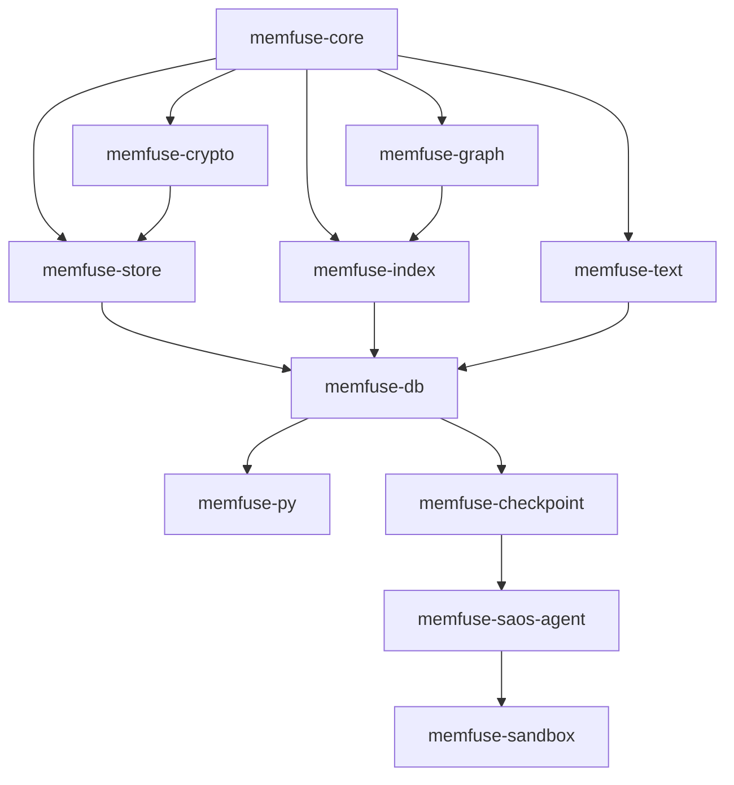

# MEMFUSE REFAKTORISIERUNGS-MASTER-PLAN

## GLOBALE PRIORISIERUNGSMATRIX

Die Refaktorisierungen müssen strikt layer-weise erfolgen, um Zirkelabhängigkeiten und instabile Schnittstellen während der Arbeit zu vermeiden.

### LAYER 0: FUNDAMENT (Woche 1)
- **memfuse-core**: Behebung der Default-No-Ops in Traits und des ResourceTracker Underflows. Dies ist die absolute Voraussetzung für alle anderen Fixes.

### LAYER 1: ENGINE-KERN (Woche 1-2)
- **memfuse-crypto**: Behebung der Nonce-Reuse Gefahr. Dieser Fix hat höchste Sicherheits-Priorität.
- **memfuse-store**: Implementierung des korrekten Rollbacks (SSTables) und Integration des Resource-Budgets in die Compaction.
- **memfuse-index**: NaN-Schutz und SIMD Safety-Audit.
- **memfuse-graph**: Optimierung der Kompaktierung (O(V+E)) und Hinzufügen von Persistenz.
- **memfuse-text**: Stabilisierung der BM25-Logik (Div-by-Zero Schutz).

### LAYER 2: ORCHESTRIERUNG (Woche 2)
- **memfuse-db**: Integration von `FusionWeights` in Hybrid-Search und Behebung der Key-Collisions im default Namespace.

### LAYER 3: INTERFACE (Woche 3)
- **memfuse-py**: Strukturiertes Exception-Mapping und Batch-Optimierung.

### FROZEN: FEATURE-EXPANSION (Post-Launch)
- **memfuse-checkpoint**, **memfuse-saos-agent**, **memfuse-sandbox**.

---

## KRITISCHER PFAD (Minimum Time to Production-Ready)

1. **Sicherheit**: `memfuse-crypto` Nonce-Reuse Fix (Blocker für verschlüsselte Deployments).
2. **Korrektheit**: `memfuse-store` Rollback Fix (Blocker für Datenintegrität).
3. **Stabilität**: `memfuse-core` Atomic Underflow Fix (Blocker für 24/7 Betrieb).
4. **Resilienz**: `memfuse-db` Repair-on-Open Audit und Namespace-Isolation.

---

## GESAMTAUFWAND-SCHÄTZUNG

| Phase              | Dauer (geschätzt) | Ressourcen |
|--------------------|-------------------|------------|
| Layer 0 + 1        | 10 Tage           | 2 Agenten  |
| Layer 2 + 3        | 4 Tage            | 1 Agent    |
| Integration & Test | 3 Tage            | Alle       |
| **Gesamt**         | **17 Tage**       |            |

---

## WIRTSCHAFTLICHES RISIKO BEI NICHT-REFAKTORISIERUNG

- **Datenverlust**: Durch den fehlerhaften Rollback in `memfuse-store` können Agenten in einen inkonsistenten Zustand geraten, der nicht durch Neustarts heilbar ist.
- **Sicherheits-Gau**: Die Nonce-Reuse Schwachstelle in `memfuse-crypto` entwertet das gesamte "Encryption-at-Rest" Versprechen.
- **DoS**: Der Underflow im `ResourceTracker` kann das System unvorhersehbar einfrieren.

---

## WETTBEWERBSPOSITIONIERUNG NACH REFAKTORISIERUNG

Nach Umsetzung dieses Plans positioniert sich MemFuse als:
1. **Sicherste embedded Vektor-DB**: Durch Sovereign Core Doctrine und verifizierte SIMD/Kryptografie.
2. **Resilienteste Engine für Agenten**: Durch echtes Time-Travel Debugging und robuste Repair-on-Open Mechanismen.
3. **Hardware-Effizient**: Durch SQ8-Quantisierung und striktes RAM-Budgeting.

---

## DEPENDENCY-GRAPH DER REFAKTORISIERUNGEN (DAG)

*Der Master-Plan wurde am 27. Mai 2026 durch den Lead Systemarchitekten finalisiert.*
