# MemFuse — Strategische Neuausrichtung & Roadmap (v3.0)
> **Senior Rust Architect & Database System Designer Review**  
> **Fokus: Cognitive Operating System für LLM-Agenten** · Stand: 2026-08-27

---

## 🏛️ Das Ziel: Das lokale Cognitive Operating System für LLM-Agenten

MemFuse hat sich von einer reinen "4-Signal Memory Engine" zu einem vollständigen **Cognitive Operating System für LLM-Agenten** entwickelt.

Anstatt nur passive Vektoren oder Chunks zu speichern, stellt MemFuse ein aktives, mehrschichtiges Kognitions-System bereit:
1. **Contextual Retrieval** (Anthropic Pattern, 49% weniger Retrieval-Fehler)
2. **Multi-Step Query & Expansion** (OpenAI o-series Pattern, bis zu 3 Runden)
3. **Cross-Encoder Reranking** (Post-RRF Neuordnung via lokalem ONNX)
4. **Session DAG Branching** (Grok Pattern, Konversationsverzweigung)
5. **Context Compaction** (Grok Pattern, Token-Reduktion)
6. **MCP Sandbox Isolation** (Anthropic Containment Pattern, AES-256-GCM-SIV)

```mermaid
graph TD
    subgraph MemFuse Cognitive OS Pipeline
        direction TB
        CI[Contextual Ingestion] --> SI[4-Signal Indexing: HNSW + BM25 + Graph + Metadata]
        SI --> RRF[Reciprocal Rank Fusion]
        RRF --> MSE[Multi-Step Query Expansion]
        MSE --> CE[Cross-Encoder Reranking]
        CE --> CC[Context Compaction]
    end
    CC --> Context[Hochrelevanter, komprimierter Agenten-Kontext]
    
    style MemFuse Cognitive OS Pipeline fill:#1a1b26,stroke:#7aa2f7,stroke-width:2px;
```

---

## 🗺️ Der 4-Phasen Stufenplan (Strategic Roadmap)

### ✅ Phase 1: RAG-Fundament & Kognitive Kern-Pipeline (abgeschlossen, HEAD 4162ebb)
> **Ziel**: Vollständige RAG-Sprints (RAG-01 bis RAG-05) im Code umgesetzt.

- [x] **LSM-Tree Storage**: MVCC, WAL, Crash-Recovery & Crypt-at-Rest.
- [x] **4-Signal Hybrid-Index**: HNSW (SIMD), BM25 (deutsche Morphologie), CSR-Wissensgraph, Metadaten.
- [x] **Contextual Retrieval**: `ContextPrefixEngine` & `combined_text_owned()` (Anthropic Pattern).
- [x] **Cross-Encoder Reranking**: `CrossEncoderReranker` in `memfuse-embed` (`--features onnx`).
- [x] **Multi-Step Query Engine**: `MultiStepEngine` in `memfuse-db` (max. 3 Schleifen).
- [x] **Context Compaction**: `ContextCompactor` & `StatusToken` in `memfuse-db`.
- [x] **Session DAG Branching**: `SessionBranchTree` & `AgentStateNode` in `memfuse-graph`.
- [x] **MCP Sandbox Isolation**: `McpSandbox` & `VolatileToolResult` in `memfuse-mcp`.
- [x] **Distribution**: `memfuse-tauri` Desktop-App, `memfuse-mcp` Server, `memfuse-py` Python-Bindings.

---

### 🔄 Phase 2: Cognitive Memory (Q4 2026)
> **Ziel**: Explizite kognitive Gedächtnistypen und temporale Wissensgraphen.

- [ ] **Kognitive Gedächtnistypen**:
  - Episodic Memory (Ereignisse, Unterhaltungen)
  - Semantic Memory (Fakten, Konzepte)
  - Procedural Memory (Workflows, Tool-Nutzungsmuster)
  - Working Memory (Kurzzeit-Kontext für aktuelle Session)
- [ ] **Temporaler Wissensgraph**:
  - Bi-temporale Zeitachsen (Validitätszeit vs. Transaktionszeit).
- [ ] **Memory Importance Scoring**:
  - LLM-bewertetes Importance-Score-System für gezieltes Vergessen/Retain.
- [ ] **Recency Decay**:
  - Mathematische Verfallsfunktion für episodische Erinnerungen.

---

### 📋 Phase 3: Selbstorganisierung (Q1 2027)
> **Ziel**: Automatische Reflexion, Konsolidierung und Multi-Hop Graph-Retrieval.

- [ ] **Memory Consolidation**:
  - Automatische Zusammenfassung und Synthese veralteter Chunks/Memories in höherwertige Erkenntnisse.
- [ ] **Personalized PageRank (PPR)**:
  - Graph-basiertes Multi-Hop-Retrieval für komplexe assoziative Suchpfade.
- [ ] **Community Detection & GraphRAG**:
  - Clustering von Wissensgraph-Knoten zu semantischen Themengebieten.
- [ ] **A-MEM Pattern**:
  - Selbst-referenzierender Zettelkasten mit expliziten Querverweisen zwischen Memories.

---

### 📋 Phase 4: Enterprise & Skalierung (Q2 2027)
> **Ziel**: Enterprise-Sicherheit, Multi-Tenancy und herstellerunabhängige Benchmarks.

- [ ] **MCP Security & Auth**:
  - OAuth 2.0 Integration und RBAC für MCP-Tools.
- [ ] **Multi-Tenant Isolation**:
  - Kryptographische und logische Mandantentrennung auf Collection- und Storage-Ebene.
- [ ] **Immutable Audit-Trail**:
  - Unveränderliche Operations-Logs für Compliance und Governance.
- [ ] **Benchmark Suite**:
  - SOTA-Vergleichstests gegen Mem0, Zep/Graphiti, MemOS und MIRIX.

---

## 🎛️ Definition of Done & Qualitäts-Gates

* **Zero Panic**: Strikte Fehlerfortpflanzung über `MemFuseError` und `?`.
* **Pure Rust Core**: Keine C-Abhängigkeiten in Layer 0–2.
* **Continuous Verification**: `cargo test`, `just check`, `just triple-test` vor allen Commits.
