# MemFuse — Strategische Neuausrichtung & Roadmap (v2.0)
> **Senior Rust Architect & Database System Designer Review**  
> **Fokus: Laser-fokussierte 3-in-1 Agent-Memory-Engine** · Stand: 2026-07-19

---

## 🏛️ Die strategische Krise: "Alles sein wollen" vs. "Unschlagbar werden"

MemFuse leidet unter **Scope Creep**. Aktuell versucht das Projekt, eine Vektordatenbank, eine Volltextsuchmaschine, eine Graphdatenbank, ein Raft-basiertes verteiltes System (`memfuse-cluster`), eine WebAssembly-Sandbox (`memfuse-sandbox`) und ein eigenständiges Agenten-Ausführungssystem (`memfuse-saos-agent`) in einem einzigen Repository zu vereinen. 

Das führt dazu, dass:
1. **Kein Bereich produktionsreif ist**: `just debt-audit` schlägt wegen offener Sicherheitswarnungen (CVEs) fehl.
2. **Kritische Invarianten gebrochen sind**: Die Zero-Panic-Doktrin wird durch 16+ Quelldateien mit `.unwrap()` verletzt.
3. **Der Kern-USP nicht nutzbar ist**: Das Graph-Signal verliert nach einem Neustart alle Daten (Persistenz-Bug), und die Python-Anbindung (`memfuse-py`) hat 0 Tests und ist nicht im Build.

### 🎯 Die neue Positionierung: Die ultimative 3-in-1 Agent-Memory-Engine

Wir positionieren MemFuse radikal um. Wir konkurrieren nicht mit hochskalierenden Cloud-Datenbanken (Qdrant, Pinecone), sondern schaffen eine neue Kategorie: **Die lokale, in-process 3-in-1 Speicher-Engine für autonome KI-Agenten.**

```mermaid
graph TD
    subgraph MemFuse 3-in-1 Engine
        direction TB
        V[Vektor-Suche: HNSW/SIMD] --> RRF[Reciprocal Rank Fusion]
        T[Text-Suche: BM25] --> RRF
        G[Graph-Navigation: CSR] --> RRF
    end
    RRF --> Context[Hochrelevanter LLM-Prompt-Kontext]
    
    style MemFuse 3-in-1 Engine fill:#1a1b26,stroke:#7aa2f7,stroke-width:2px;
```

#### Warum diese Positionierung unschlagbar ist:
* **Das Problem bei bestehenden DBs**: Agenten benötigen drei Arten von Gedächtnis: *episodisch* (Vektorsuche), *lexikalisch* (Volltextsuche) und *assoziativ* (Entity-Relation-Graphen). Derzeit müssen Entwickler dafür drei verschiedene Systeme betreiben (z. B. Chroma + Elasticsearch + Neo4j).
* **Die MemFuse-Lösung**: Eine einzige Rust-Bibliothek, die in-process läuft (kein Server, kein Docker), zero C-Abhängigkeiten im Kern besitzt und alle drei Signale über **Reciprocal Rank Fusion (RRF)** zu einem optimalen Prompt-Kontext verschmilzt.

---

## ✂️ Radikaler Scope-Schnitt (Entscheidungsmatrix)

Wir bereinigen das Repository und trennen uns von allen Modulen, die nicht direkt zu dieser Positionierung beitragen.

| Crate | Status | Aktion | Begründung |
| :--- | :--- | :--- | :--- |
| `memfuse-core` | 🔴 Panics | **Härten** | Das Fundament für Typen, Fehler und Puffer. Alle `unwrap()` müssen eliminiert werden. |
| `memfuse-store` | 🟡 Bugs / CVE | **Härten** | LSM-Tree und WAL. Beheben von FIND-STO-001 (Phantom-Daten) und Upgrade der CVE-behafteten Deps (`memmap2`, `lru`). |
| `memfuse-index` | 🟡 Panics | **Härten** | HNSW-Vektorindex. Zero-Panic durchsetzen, Endian-Safety sichern. |
| `memfuse-text` | 🟢 Clean | **Pflegen** | BM25-Volltextsuche. Stabil, wird unverändert übernommen. |
| `memfuse-crypto`| 🟡 Panics | **Härten** | AES-GCM-SIV Verschlüsselung. Zero-Panic durchsetzen. |
| `memfuse-graph` | 🔴 Kaputt | **Reaktivieren & Persistieren** | **Kritisch für USP!** CSR-Graph muss im LSM-Tree persistent gemacht werden (FIND-GRA-001 beheben), sonst verliert der Graph bei jedem Neustart alle Beziehungen. |
| `memfuse-py` | 🔴 Keine Tests | **Reaktivieren & Stabilisieren** | **Der wichtigste Vertriebskanal!** Python-Entwickler bauen 95% aller KI-Agenten. Ohne PyPI-Paket existiert das Produkt am Markt nicht. |
| `memfuse-embed` | 🧊 Frozen | **Optionalisieren (Feature-Gate)** | Das Einbetten von ONNX (`ort`) bringt schwere C-Laufzeitbibliotheken mit, was das "Sovereign Core"-Prinzip verletzt. Wird als rein optionales Feature ausgegliedert. |
| `memfuse-cluster` | 🧊 Frozen | **Löschen / Auslagern** | Raft-Konsens und gRPC-Verteilung sind für eine in-process Engine irrelevant und verlangsamen die Entwicklung durch extreme Komplexität. |
| `memfuse-sandbox` | 🧊 Frozen | **Löschen / Auslagern** | WebAssembly-Sandboxing ist Aufgabe des Agenten-Ausführungssystems, nicht der Speicher-Engine. |
| `memfuse-saos-agent`| 🧊 Frozen | **Löschen / Auslagern** | MemFuse ist eine Datenbank/Memory-Engine, kein Agenten-Orchestrator. |

> [!IMPORTANT]
> Durch diese Ausmistung reduzieren wir die Codebasis um **über 2.500 Zeilen ungenutzten, fehlerhaften Legacy-Codes** und gewinnen den Fokus zurück, um die verbleibenden 6 Crates + Python-Bindings auf Enterprise-Niveau zu härten.

---

## 🗺️ Der konkrete Fahrplan (Roadmap v2.0)

Die Roadmap ist so aufgebaut, dass wir schnellstmöglich ein **funktionierendes Produkt am Markt platzieren**, anstatt uns in internen theoretischen Härtungen zu verlieren.

### Phase 0: Scope-Bereinigung & Sicherheitsgarantien (Woche 1)
> **Ziel**: Ein sauberes Repository ohne Altlasten und ohne bekannte Sicherheitslücken.

- [ ] **P0-1: Repository-Entschlackung**: 
  - Entfernen von `memfuse-cluster`, `memfuse-sandbox` und `memfuse-saos-agent` aus dem Cargo-Workspace.
  - Archivieren dieser Crates in ein separates Backup-Repository (z. B. `memfuse-archived`).
- [ ] **P0-2: Sicherheits-Updates (CVEs)**:
  - Upgrade von `memmap2` auf eine sichere Version (RUSTSEC-2026-0186 beheben).
  - Ersetzen der unsounden `lru`-Crate durch `quick_cache` (RUSTSEC-2026-0002 beheben).
- [ ] **P0-3: Dokumenten-Konsolidierung**:
  - Zusammenführen aller überlappenden Spezifikationen und Audits in ein einziges Living Document (`docs/SOURCE_OF_TRUTH.md`).
  - Löschen veralteter oder doppelter `.md`-Dateien gemäß dem MECE-Prinzip.

---

### Phase 1: Die 4-Signal-Garantie & Zero-Panic (Woche 2–4)
> **Ziel**: Beseitigung aller Bugs, die zu Datenverlust oder Programmabstürzen führen. Aktivierung der Graph-Persistenz.

- [ ] **P1-1: Radikaler Zero-Panic-Audit**:
  - Ersetzen aller `std::sync::RwLock` durch `parking_lot::RwLock` in `memfuse-db` zur Eliminierung von Poison-Panics (Löscht 12+ `.unwrap()`).
  - Systematisches Ersetzen aller verbleibenden `.unwrap()` und `.expect()` im Produktionscode durch sichere Fehlerfortpflanzung über `MemFuseError` und den `?`-Operator.
- [ ] **P1-2: Behebung von Datenverlust-Bugs**:
  - **FIND-STO-001 (Compaction Tombstone)**: Tombstones im LSM-Tree dürfen nur gelöscht werden, wenn es sich um eine vollständige Compaction (Full-Compaction) handelt, um Phantom-Daten zu verhindern.
  - **FIND-DB-002 (drop_collection)**: Implementieren von `delete_prefix()` auf Storage-Ebene, um Datenleichen beim Löschen von Collections zu verhindern.
  - **FIND-DB-003 (Dirty Reads)**: Einbinden von `SnapshotGuard` in den Suchpfad zur Gewährleistung echter Snapshot-Isolation (MVCC).
- [ ] **P1-3: Graph-Persistenz (USP-Enabler)**:
  - Reaktivierung des `memfuse-graph` Crates im Workspace.
  - Implementierung einer CSR-Graph-Persistierung im LSM-Tree unter dem Namespace `__graph:`.
  - Lösen des Persistenz-Bugs (FIND-GRA-001), sodass Beziehungen nach einem Neustart erhalten bleiben.

---

### Phase 2: Python-First & Release-Bereitschaft (Woche 5–7)
> **Ziel**: MemFuse wird für 95% der Agenten-Entwickler installierbar.

- [ ] **P2-1: Python FFI-Härtung (`memfuse-py`)**:
  - Reaktivierung des `memfuse-py`-Crates im Workspace.
  - Beheben des Layer-Leakage-Bugs (FIND-PY-001): Verschiebung der FlatBuffer-Generierung aus dem Python-Crate in den `memfuse-core::ipc`-Modul.
  - Freigabe des Python-GIL während rechenintensiver Suchen oder Serialisierungen (`py.allow_threads`).
- [ ] **P2-2: pytest-Testsuite**:
  - Schreiben einer robusten Python-Testsuite mit mindestens 20 Integrationstests (CRUD, Hybrid-Search, Graph-Beziehungen, Crash-Recovery).
- [ ] **P2-3: PyPI & crates.io Alpha-Release**:
  - Veröffentlichung von `memfuse` auf PyPI (`pip install memfuse`).
  - Veröffentlichung des Kern-Crates auf crates.io (`cargo add memfuse-db`).
  - Bereitstellung von 3 ausführbaren Beispielen (`quickstart.py`, `hybrid_search.py`, `graph_memory.py`).

---

### Phase 3: Unschlagbarkeit beweisen (Woche 8+)
> **Ziel**: Benchmarks veröffentlichen, das Entwickler-Ökosystem erobern und direkte LLM-Integration ermöglichen.

- [ ] **P3-1: Model Context Protocol (MCP) Server**:
  - Entwicklung eines eingebauten **MemFuse MCP-Servers**. Damit können moderne LLM-Clients wie Claude Desktop die lokale MemFuse-Datenbank direkt als Werkzeug nutzen, ohne dass Entwickler eine einzige Zeile Code schreiben müssen.
- [ ] **P3-2: Performance-Benchmarks veröffentlichen**:
  - Durchführung und Veröffentlichung verifizierter Vergleiche mit ChromaDB und LanceDB (Latenz im Suchpfad, Speicherbedarf bei SQ8-Quantisierung, RRF-Fusion-Genauigkeit).
- [ ] **P3-3: Community Launch (HackerNews / Reddit)**:
  - Vorstellung der Engine als: *"The local-first 3-in-1 vector, text & graph memory for AI agents"*.

---

## 📈 Der kritische Pfad der Implementierung

```mermaid
gantt
    title MemFuse Implementierungs-Sequenz (Wochen)
    dateFormat  X
    axisFormat %d
    
    section Phase 0
    Scope-Bereinigung & CVE Fixes :active, p0, 0, 1
    
    section Phase 1
    Zero-Panic Audit & Lock-Refactoring : p1_1, 1, 2
    Datenverlust-Bugs (LSM, MVCC) : p1_2, 2, 3
    Graph-Persistenz im LSM-Tree : p1_3, 2, 4
    
    section Phase 2
    Python-Bindings & FlatBuffer FFI : p2_1, 4, 5
    pytest Integrationstests : p2_2, 5, 6
    PyPI & crates.io Release : p2_3, 6, 7
    
    section Phase 3
    MCP-Server Integration : p3_1, 7, 8
    Benchmarks & Launch : p3_2, 8, 9
```

---

## 🎛️ Definition of Done (Qualitäts-Gates)

Eine Phase gilt erst als abgeschlossen, wenn folgende Kriterien erfüllt sind:

### Phase 0
* [ ] `just debt-audit` läuft fehlerfrei durch und meldet 0 bekannte CVEs.
* [ ] Die Crates `memfuse-cluster`, `memfuse-sandbox` und `memfuse-saos-agent` sind vollständig aus dem Cargo-Workspace entfernt.
* [ ] Die Dokumentation enthält keine redundanten oder widersprüchlichen Spezifikationsdateien mehr.

### Phase 1
* [ ] `cargo check --all-targets` und `cargo clippy --all-targets -- -D warnings` sind grün.
* [ ] Eine Code-Suche mit `rg 'unwrap\(\)' crates/` liefert 0 Treffer im Produktionscode (ausgenommen Test-Module).
* [ ] Ein Integrationstest beweist, dass Graph-Beziehungen einen Datenbank-Neustart (Crash-Recovery) fehlerfrei überleben.

### Phase 2
* [ ] `pip install memfuse` installiert die Bibliothek plattformübergreifend.
* [ ] Die `pytest`-Suite verifiziert alle CRUD- und Hybrid-Search-Szenarien ohne Speicherlecks oder Abstürze.
* [ ] Das offizielle Quickstart-Beispiel funktioniert per Copy-Paste.
