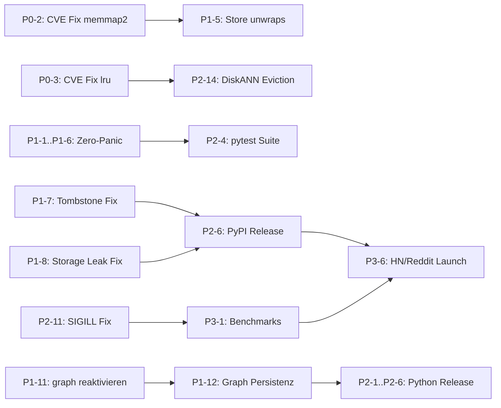

# MemFuse — Strategische Ausrichtung & Konkreter Fahrplan
> Senior Rust Architect Review · Stand: 2026-07-19

---

## 0. Ist-Zustand: Ehrliche Diagnose

> [!CAUTION]
> `just debt-audit` schlägt fehl mit **1 aktiver CVE** und **16+ Dateien mit `.unwrap()`** im Produktionscode — darunter Sovereign Core. Die "Zero-Panic"-Policy ist aktuell eine **Behauptung, kein bewiesener Zustand**.

### Code-Realität vs. Dokumentation

| Dimension | Dokumentation (SOT) | Tatsächlicher Code-Zustand |
|---|---|---|
| Zero-Panic | `🟢 Clean` für alle 7 Crates | `unwrap()` in `memfuse-db`, `memfuse-store`, `memfuse-index`, `memfuse-core`, `memfuse-crypto`, `memfuse-graph` |
| `memfuse-py` Tests | `0*` (blockiert durch C-Deps) | 0 Tests, auskommentiert aus Workspace |
| `memfuse-graph` Persistenz | CSR implementiert, 8 Tests | **FIND-GRA-001**: Graph verliert alle Daten nach Neustart |
| Snapshot Isolation | ✅ Verifiziert | **FIND-DB-003**: Dirty Reads möglich in Search-Pfad |
| Compaction Safety | WAL robust | **FIND-STO-001**: Phantom-Daten nach Teil-Compaction |
| Security | — | **RUSTSEC-2026-0186** (`memmap2`), **RUSTSEC-2026-0002** (`lru`) — aktive Advisories |

### Was tatsächlich im Workspace ist

```toml
# Aktive Members (buildfähig):
memfuse-core, memfuse-store, memfuse-index, memfuse-db,
memfuse-text, memfuse-checkpoint, memfuse-crypto  # 7 Crates, ~13.600 LOC

# Auskommentiert (NICHT buildbar als Workspace):
# memfuse-graph, memfuse-py, memfuse-cluster,
# memfuse-embed, memfuse-sandbox, memfuse-saos-agent
```

**Kritischer Gap:** `memfuse-graph` — das "Graph"-Signal der beworbenen 4-Signal-Fusion — ist **nicht im Build**. `memfuse-py` — der einzige Weg zu AI-Agent-Ökosystemen — ist **nicht im Build und hat 0 Tests**.

---

## 1. Richtungsentscheidung: C ist richtig — aber der Weg ist falsch priorisiert

**Strategie-Urteil:** Option C (lokale Agent-Memory-Library) ist der einzig gangbare Startpunkt. Die Analyse ist korrekt. Die Ausführungsreihenfolge ist es nicht.

### Warum die aktuelle Priorisierung falsch ist

Die bisherigen Sprints (1–3) haben sich auf interne Härtung konzentriert: ACID, WAL, Tests. Das ist wertvoll — aber das Produkt existiert für externe Nutzer nicht. Der erste Schritt für einen Nutzer wäre:

```bash
pip install memfuse  # → Package existiert nicht auf PyPI
```

Das ist der echte Blocker. Nicht die Compaction-Optimierung.

### Die Bezos-Invarianten vs. aktueller Status

| Invariante | Status | Kritischster Block |
|---|---|---|
| **1. Sofort funktioniert** | ❌ Kritisch | PyPI-Paket existiert nicht, keine Quickstart-Beispiele die wirklich laufen |
| **2. Niemals Daten verliert** | ⚠️ Lücken | FIND-STO-001 (Phantom-Daten), FIND-DB-005 (2PC Split-Brain) |
| **3. Blitzschnell** | ⚠️ Unbewiesen | Keine publizierten Benchmarks, kein Vergleich mit Konkurrenz |
| **4. Keine Ops-Last** | ✅ Stark | Zero-C-Deps im Core, Embedded, kein Server |

**Invariante 4 ist euer echter USP.** Baut alles andere darum.

---

## 2. Nicht-Kern-Crates: Entscheidungsmatrix

| Crate | LOC | Passt zu C? | Entscheidung | Begründung |
|---|---|---|---|---|
| `memfuse-graph` | 521 | ✅ Zentral | **Reaktivieren** | Ist Signal 3 der 4-Signal-Fusion. Ohne Graph kein USP gegenüber ChromaDB. FIND-GRA-001 (Persistenz) muss vorher gelöst werden. |
| `memfuse-py` | ~1.000 | ✅ Kritisch | **Reaktivieren, höchste Prio** | Kein PyPI → keine Agent-Ökosystem-Anbindung → kein Vertriebskanal für C. FIND-PY-001 (Layer Leakage) beheben. |
| `memfuse-embed` | 260 | ⚪ Nice-to-have | **Geparkt lassen** | Bringt ONNX/C-Deps mit. Widerspricht Zero-C-Deps im Default. Opt-in Feature-Flag später. |
| `memfuse-cluster` | ~1.200 | ❌ Nein | **Aus Repo entfernen** | FIND-CLU-001/002/003: Alles kritisch, vollständig funktionsunfähig als Cluster-DB. Für ein eingebettetes lokales Produkt irrelevant. |
| `memfuse-sandbox` | 627 | ❌ Nein | **Aus Repo entfernen** | WASM-Sandboxing ist ein anderes Produkt. |
| `memfuse-saos-agent` | 551 | ❌ Nein | **Aus Repo entfernen** | Strategisch eingefroren, kein Bezug zu C. |

**Netto-Effekt:** ~2.600 LOC toter Code raus, ~1.520 LOC (graph + py) rein und zur Chefsache gemacht.

---

## 3. Konkreter Fahrplan (4 Phasen)

### Phase 0 — Scope-Schnitt & Security (Woche 1–2)
> **Ziel:** Saubere Basis. Keine offenen CVEs, kein Zombie-Code im Repo.

| # | Task | Severity | Aufwand | Finding |
|---|---|---|---|---|
| P0-1 | `memfuse-cluster`, `memfuse-sandbox`, `memfuse-saos-agent` in separates `memfuse-agentos`-Repo verschieben (nicht löschen) | — | S | Scope-Fokus |
| P0-2 | `memmap2` auf gepatchte Version upgraden oder durch Alternative ersetzen | 🔴 Sicherheit | S | RUSTSEC-2026-0186 |
| P0-3 | `lru` upgraden oder durch `std::collections::HashMap` + manuelle LRU ersetzen | 🔴 Sicherheit | S | RUSTSEC-2026-0002 |
| P0-4 | Docs konsolidieren: `docs/audits/` → Erkenntnisse in `SOURCE_OF_TRUTH.md`. Doppelte `memfuse_product_spec (1).md` löschen. Alle 6+ überlappenden Analyse-Docs auf eines reduzieren | — | S | Governance-Verstoß |
| P0-5 | README/SOURCE_OF_TRUTH/Mission-Statement neu schreiben: *"MemFuse ist die eingebettete 4-Signal-Memory-Engine für lokale AI-Agenten"* | — | S | Produktklarheit |

---

### Phase 1 — P0-Bugs (Kunden-Blocker) (Woche 2–6)
> **Ziel:** Die 4 Bezos-Invarianten erfüllen. Kein Bug, der frühe Nutzer sofort verbrennt.

#### 1a. Zero-Panic wirklich durchsetzen (Invariante 2)

| # | Task | Severity | Aufwand | Finding |
|---|---|---|---|---|
| P1-1 | `unwrap()` in `memfuse-db/src/lib.rs` (L351, L754, L760, L768, L781, L786): RwLock-Panics → `parking_lot::RwLock` (panic-free) oder `map_err(|_| MemFuseError::LockPoisoned)` | 🔴 Kritisch | S | FIND-DB-001 |
| P1-2 | `unwrap()` in `memfuse-db/src/collection.rs` (L74, L115, L125, L285, L318, L821): gleiche Strategie | 🔴 Kritisch | S | FIND-DB-001 |
| P1-3 | `unwrap()` in `memfuse-db/src/chunker.rs` (L249, L253, L257, L277): Tests-Only prüfen, sonst `ok_or`-Mapping | 🔴 Kritisch | S | NEVER-Rule |
| P1-4 | `memfuse-core` (`tx_buffer.rs`, `snapshot.rs`, `traits.rs`, `types/`): alle `unwrap()` auditieren und ersetzen | 🔴 Kritisch | M | NEVER-Rule |
| P1-5 | `memfuse-store` (`wal.rs`, `lsm.rs`, `sstable.rs`, `compaction.rs`, `memtable.rs`): alle `unwrap()` auditieren | 🔴 Kritisch | M | NEVER-Rule |
| P1-6 | `memfuse-crypto` (`wal_crypto.rs`, `crypto.rs`): `unwrap()` → `?` | 🔴 Kritisch | S | NEVER-Rule |

> [!NOTE]
> **Strategie für RwLock-unwraps:** Ersetze `std::sync::RwLock` durch `parking_lot::RwLock` (bereits in `[workspace.dependencies]`). `parking_lot::RwLock::read()` gibt direkt `RwLockReadGuard` zurück, kein `Result` — eliminiert alle Poison-unwraps auf einen Schlag.

#### 1b. Datenverlust-Bugs (Invariante 2)

| # | Task | Severity | Aufwand | Finding |
|---|---|---|---|---|
| P1-7 | **Compaction Tombstone Fix**: Tombstones in STCS nur löschen wenn Full-Compaction oder nachweislich unterstes Tier | 🔴 Kritisch | M | FIND-STO-001 |
| P1-8 | **drop_collection Storage Leak**: `delete_prefix()` in LSM bei Collection-Drop implementieren | 🔴 Kritisch | M | FIND-DB-002 |
| P1-9 | **Snapshot Isolation in Search**: `SnapshotGuard` in `search_with_filter` und `hydrate_from_tuples` einführen | 🔴 Kritisch | H | FIND-DB-003 |
| P1-10 | **fsync WAL-Parent-Directory**: Directory-fsync nach UUID-Persistierung ergänzen | 🟢 Niedrig | S | FIND-STO-004 |

#### 1c. Graph-Reaktivierung (4-Signal-Fusion reparieren)

| # | Task | Severity | Aufwand | Finding |
|---|---|---|---|---|
| P1-11 | `memfuse-graph` in Workspace-Members reaktivieren (Cargo.toml) | — | XS | Scope |
| P1-12 | **Graph Persistenz**: CSR-Serialisierung in `memfuse-store` WAL-Namespace integrieren (`__graph:..`) | 🔴 Kritisch | H | FIND-GRA-001 |
| P1-13 | Graph-Compaction O(N+E) → inkrementell: staged edges lazy mergen statt full-rebuild | 🟡 Mittel | M | FIND-GRA-002 |
| P1-14 | `MAX_TRAVERSAL_HOPS` zur Laufzeit konfigurierbar machen | 🟢 Niedrig | S | FIND-GRA-003 |

---

### Phase 2 — Release-Fähigkeit (Woche 6–12)
> **Ziel:** `v0.1.0` auf crates.io und PyPI. Erste externe Nutzer möglich.

#### 2a. Python-Bindings (höchste Prio — Vertriebskanal)

| # | Task | Severity | Aufwand | Finding |
|---|---|---|---|---|
| P2-1 | `memfuse-py` in Workspace-Members reaktivieren | — | XS | Scope |
| P2-2 | **Layer-Leakage Fix**: FlatBuffer-Konstruktion (`search_fb`, `hybrid_search_fb`) aus `memfuse-py` in `memfuse-core::ipc` verschieben | 🔴 Kritisch | M | FIND-PY-001 |
| P2-3 | GIL-Bottleneck: FlatBuffer-Konstruktion vollständig in `allow_threads`-Block verschieben | 🟡 Mittel | S | FIND-PY-002 |
| P2-4 | **pytest-Testsuite**: ≥20 Integrationstests via `maturin develop` — Quickstart, CRUD, Hybrid-Search, Crash-Recovery | — | H | 0 Tests aktuell |
| P2-5 | `pyproject.toml` vervollständigen + maturin CI-Pipeline | — | M | Release-Blockade |
| P2-6 | PyPI v0.1.0-alpha veröffentlichen | — | S | Invariante 1 |

#### 2b. Rust-API & crates.io

| # | Task | Severity | Aufwand | Finding |
|---|---|---|---|---|
| P2-7 | Nightly-Abhängigkeiten prüfen: `rust-toolchain.toml` auf stable Rust 1.89+ migrieren wenn möglich | — | M | Stabilität |
| P2-8 | `memfuse-db` Public API konsolidieren: `MemFuse::open(path)` als stabiler Entry-Point | — | M | DX |
| P2-9 | 3 funktionierende Rust-Beispiele: `quickstart.rs`, `hybrid_search.rs`, `crash_recovery.rs` | — | M | Invariante 1 |
| P2-10 | crates.io v0.1.0 Release | — | S | Vertriebskanal |

#### 2c. HNSW-Qualität

| # | Task | Severity | Aufwand | Finding |
|---|---|---|---|---|
| P2-11 | **SIGILL-Prüfung**: `is_x86_feature_detected!` vor jedem AVX-512-Pfad verifizieren | 🔴 Kritisch | S | FIND-IND-001 |
| P2-12 | **SQ8 Per-Dimension**: Globale Min/Max-Quantisierung → per-dimension quantization | 🟡 Mittel | M | FIND-IND-002 |
| P2-13 | HNSW-Save Endian-Safety: `to_le_bytes()` statt raw ptr cast | 🟡 Mittel | S | FIND-IND-003 |
| P2-14 | DiskANN LRU-Eviction: `cache.clear()` → LRU-Eviction (nach P0-3 lru-Fix) | 🟢 Niedrig | S | FIND-IND-004 |

---

### Phase 3 — Sichtbarkeit & Wachstum (Woche 12+)
> **Ziel:** Externe Nutzer gewinnen. Benchmarks veröffentlichen. Community aufbauen.

| # | Task | Aufwand | Rationale |
|---|---|---|---|
| P3-1 | **Öffentliche Benchmark-Suite**: MemFuse vs. ChromaDB vs. LanceDB — 1536-dim, 100K Docs, Hybrid Search Latenz (P50/P99), Throughput | H | Ohne Zahlen bleibt "4-Signal-Fusion" reine Behauptung |
| P3-2 | `async-trait` → AFIT-Migration (Rust 1.75+) für Hot-Path-Latenz | M | Performance-Differenzierung |
| P3-3 | `CancellationToken` für Graceful Shutdown in `memfuse-db` | S | Produktionsreife |
| P3-4 | HNSW-Repair O(1): `doc_to_node` Map statt k=1-Search für Präsenzprüfung | M | FIND-DB-004 |
| P3-5 | 2PC Recovery-Log: "Commit-Intents" persistent machen gegen Split-Brain | H | FIND-DB-005 |
| P3-6 | HN/Reddit-Launch mit Benchmark-Zahlen | — | Einziger realistischer Weg zu echten Nutzern |
| P3-7 | MCP (Model Context Protocol) Integration — macht MemFuse direkt nutzbar in Claude/GPT-Agents | M | Ecosystem-Anbindung |

---

## 4. Kritischer Pfad (Dependency-Reihenfolge)



**Kritischer Pfad:** P0-2 → P1-7 → P1-8 → P1-9 → P2-6 → P3-6

---

## 5. Was die Nicht-Kern-Crates für Richtung A bedeuten

> [!TIP]
> Richtung A (Sovereign Edge) ist **nicht widersprüchlich zu C** — es ist das gleiche Fundament, höher positioniert. Wenn C die Zero-C-Deps, ACID-Garantien und SIMD-Performance beweist (mit publizierten Benchmarks), ist der Pivot zu A in 12–18 Monaten trivial. Die `memfuse-cluster`- und `memfuse-sandbox`-Arbeit geht nicht verloren, sie wird in einem separaten Repo gepflegt bis die Community-Traktion von C sie rechtfertigt.

---

## 6. Offene Fragen (Entscheidungen nötig)

| # | Frage | Options | Empfehlung |
|---|---|---|---|
| F1 | Wie wird `memfuse-graph` persistiert? | (a) WAL-Namespace `__graph:`, (b) Eigenes `.graph`-Binärformat analog HNSW | (a) — nutzt bestehende WAL-Garantien, weniger Code |
| F2 | `memmap2` CVE: Ersetzen oder warten auf Upstream-Patch? | (a) Auf `memmap2` 0.10+ warten, (b) `mmap`-Calls manuell via `std::fs` | Upstream-Patch prüfen, wenn >2 Wochen → manuelle Migration |
| F3 | `lru` CVE: `lru`-Crate oder eigene Impl? | (a) `quick_cache` als Alternative, (b) `HashMap` + Slab | `quick_cache` prüfen (sound, aktiv gewartet) |
| F4 | Python-API Scope: GIL-free oder Sync? | (a) Sync mit `allow_threads`, (b) `asyncio`-native via `pyo3-asyncio` | (a) zuerst — einfacher, reicht für MVP |

---

## 7. Exit-Kriterien (Definition of Done pro Phase)

### Phase 0 ✅ wenn:
- [ ] `just debt-audit` ohne CVE-Fehler durchläuft
- [ ] Nur 7 Core-Crates + graph + py im Workspace
- [ ] Ein einziges konsolidiertes Analyse-Dokument (SOURCE_OF_TRUTH.md)

### Phase 1 ✅ wenn:
- [ ] `just triple-test` 3× grün
- [ ] `rg 'unwrap()' crates --glob '*.rs'` liefert 0 Treffer außerhalb `#[cfg(test)]`
- [ ] FIND-STO-001 Regression-Test existiert und ist grün
- [ ] `memfuse-graph` ist im Workspace und Graph-State überlebt Neustart

### Phase 2 ✅ wenn:
- [ ] `pip install memfuse` funktioniert (PyPI alpha)
- [ ] 20+ pytest-Tests grün via `maturin develop`
- [ ] `cargo add memfuse-db` + Quickstart-Beispiel kompiliert und läuft
- [ ] crates.io v0.1.0 veröffentlicht

### Phase 3 ✅ wenn:
- [ ] Öffentliche Benchmark-Zahlen im README (Latenz, Throughput vs. Chroma/LanceDB)
- [ ] HN-Post oder equivalent mit >100 Upvotes → reales Nutzerfeedback

