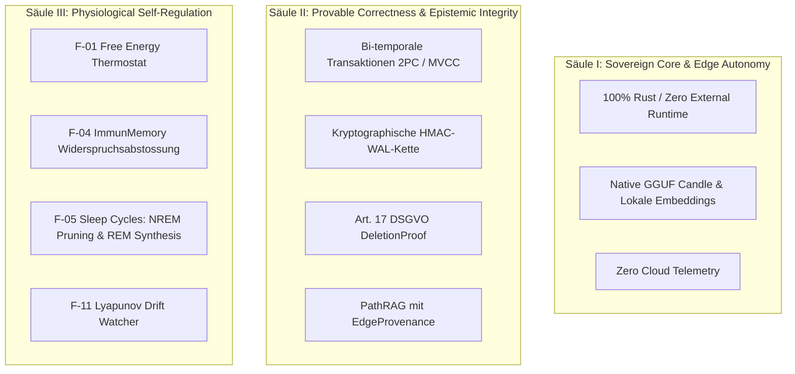

# MemFuse — Konsolidierte Gesamtspezifikation (Monolith)
## Vollständige normative Architektur- & Systemspezifikation · Stand HEAD `84dc87e1`

> **Dokument-Typ:** Normative Gesamtspezifikation — einzige maßgebliche Wahrheitsquelle für das Gesamtsystem MemFuse.
> **Version:** 8.0 — „Verified Monolith" (konsolidiert und löst v5.0, v6.0, v7.0 sowie alle Zwischenentwürfe vollständig ab).
> **Stand:** 07. September 2026 · **HEAD:** `84dc87e1` (`main`)
> **Kennzahlen (verifiziert):**
> — **18 Workspace-Crates** (17 Kern-Crates + 1 optional `memfuse-embed`) + `xtask` + separates Workspace `memfuse-py` (ADR-064)
> — **~126.600 LOC Rust** (inkl. Tests und Benchmarks)
> — **65 ADRs** (`docs/decisions/ADR-001` … `ADR-065`)
> — **Strikter DAG-Schichtenaufbau (Layer 0 bis Layer 6)**, CI-überwacht via `cargo xtask check-dag`
> — **0 ungeprüfte Veto-Verletzungen**, CI-überwacht via `cargo xtask check-vetoes`
> — **Automatisierte Duplikat-Symbol-Prüfung**, CI-überwacht via `cargo xtask check-duplicate-symbols` (ADR-065)

---

## Inhaltsverzeichnis

- **§0 Methodische Grundlagen, Quellenhierarchie & Verifikationsprinzip**
- **§1 Produktvision, Kernsäulen & Architekturprinzipien (P1–P12)**
- **§2 Crate-Topologie — Vollständige Zielarchitektur (18 Crates, DAG Layer 0–6)**
- **§3 Layer 0 — Fundament: Typen, Domänenmodelle, Kalibrierung, Krypto-Primitiven**
- **§4 Layer 1 — Storage-Primitiven & Vertikalen**
  - §4.1 `memfuse-crypto`: Verschlüsselung & Löschnachweise (`DeletionProof`)
  - §4.2 `memfuse-checkpoint`: Snapshot- & Backup-Management
  - §4.3 `memfuse-graph`: CSR-Graph, `PathRAGEngine`, `ImmunMemory` & `EdgeProvenance`
  - §4.4 `memfuse-text`: BM25, IDF-Glättung & DACH-Kompositaspaltung
  - §4.5 `memfuse-candle`: Native GGUF-ML-Inferenz
  - §4.6 `memfuse-kv-bridge`: Sichere Mandanten-KV-Cache-Bridge (LRU, Zeroize)
- **§5 Layer 2 — Subsysteme & Suchfusion**
  - §5.1 `memfuse-embed`: Text-Embeddings & Cross-Encoder-Reranking
  - §5.2 `memfuse-index`: HNSW, SQ8-Quantisierung, DiskANN (WAL-backed Pending-Buffer)
  - §5.3 `memfuse-ollama`: HTTP-Client & Kontextpräfix-Engine
  - §5.4 `memfuse-store`: LSM-Tree Storage-Engine & WAL V3
- **§6 Layer 3 — Hauptdatenbank & Physiologische Selbstregulierung**
  - §6.1 `memfuse-db`: Multi-Index-Transaktionen (2PC) & Hybride Suche
  - §6.2 `PhysioScheduler`: Sequenzielle Orchestrierung aller Gedächtniszyklen
  - §6.3 `FreeEnergyThermostat` (F-01): Thermodynamischer Gedächtniszerfall
  - §6.4 `SleepCycleEngine` (NREM & REM): Strukturelle Bereinigung & generative Synthese
- **§7 Layer 4 — Orchestrierung & Frontend-Grenzschichten**
  - §7.1 `memfuse-router`: Konformales Routing, SLM-Profile & Lyapunov-Drift-Wächter (F-11)
  - §7.2 `memfuse-tauri`: Desktop-Anwendungsschale & lokale Ingestion
- **§8 Layer 5 — Agenten-Engine**
  - §8.1 `memfuse-agent`: Persistente ReAct-Agentenschleife & Kontextkompaktierung
- **§9 Layer 6 — Protokoll & Sandbox**
  - §9.1 `memfuse-mcp`: Model Context Protocol (MCP) stdio JSON-RPC 2.0 Server
- **§10 Layer-übergreifend — Benchmarking & Evaluation (`memfuse-bench`)**
- **§11 Physio-Feature-Katalog (F-01 bis F-11) — Normativer Gesamtstatus**
- **§12 Invarianten-Verzeichnis (Normativ)**
- **§13 Definition of Done (DoD) & Release-Kriterien**
- **§14 Governance & Prozessmodell**
- **Anhang A: Detaillierter Wettbewerbsvergleich**
- **Anhang B: Permanent verworfene Features (`VETOES.md`)**
- **Anhang C: ArXiv-Referenzbibliothek (Tier 1–3)**
- **Anhang D: Verweis auf das Monolithische Bug- und Schuldendokument**

---

## §0 Methodische Grundlagen, Quellenhierarchie & Verifikationsprinzip

### §0.1 Quellenhierarchie (Normativ)
Widersprüche zwischen Dokumenten, Kommentaren und Code werden strikt nach folgender Hierarchie entschieden:
1. **Tatsächlicher Codebefund am aktuellen Git HEAD** (Ground Truth: Was kompiliert und getestet ist, sticht jede Spekulation).
2. **Architekturentscheidungen (`docs/decisions/ADR-xxx.md`)** (Normativ begründete Design-Vorgaben).
3. **Diese Gesamtspezifikation (`docs/plans/memfuse_gesamtspezifikation.md`)**.
4. **Veto-Register (`VETOES.md`)**.
5. **Ältere Spezifikationen, Reviews und temporäre Notizen** (Historischer Kontext, unverbindlich).

### §0.2 Verifikationsprinzip
Jede technische Aussage in dieser Spezifikation ist entweder:
- Durch Datei- und Zeilenreferenzen am HEAD `84dc87e1` direkt im Quellcode nachgewiesen,
- Durch einen referenzierten ADR normativ festgelegt, oder
- Durch ein begutachtetes wissenschaftliches Paper (ArXiv) belegt.

---

## §1 Produktvision, Kernsäulen & Architekturprinzipien (P1–P12)

MemFuse ist eine **souveräne, lokale Gedächtnisdatenbank für autonome KI-Agenten**. Sie verbindet kryptographisch belegbare Mandantensicherheit und Deterministik mit biologisch inspirierten physiologischen Selbstregulierungsmechanismen.

### §1.1 Die drei Kernsäulen



1. **Säule I — Sovereign Core & Edge Autonomy:**
   MemFuse läuft vollständig auf Edge-Geräten und lokalen Servern ohne Abhängigkeit von externen Cloud-APIs. Die Inferenz (Embeddings, Reranking, SLM-Routing) erfolgt lokal über Candle oder Ollama.
2. **Säule II — Provable Correctness & Epistemic Integrity:**
   Jede Kante und jedes Dokument besitzt lückenlose Provenienz (`EdgeProvenance`, `ProvenanceRecord`). Löschungen sind kryptographisch nachweisbar (`DeletionProof`). Transaktionen garantieren ACID-Eigenschaften über Vektor-, Text-, Graph- und Key-Value-Indizes via Two-Phase-Commit (2PC).
3. **Säule III — Physiological Self-Regulation:**
   Agentengedächtnis akkumuliert Rauschen und Widersprüche. MemFuse nutzt thermodynamische und immunologische Prinzipien (adaptiver Zerfall, Hebbian Learning, Sleep Cycles, Lyapunov-Stabilität), um Gedächtnis automatisch zu konsolidieren und zu bereinigen.

---

### §1.2 Architekturprinzipien (P1–P12)

| Prinzip | Name | Normative Vorgabe |
|---|---|---|
| **P1** | **DAG-Integrität** | Keine zyklischen Abhängigkeiten zwischen Crates. Schichten dürfen nur nach unten referenzieren. Automatisch geprüft via `cargo xtask check-dag`. |
| **P2** | **Zero-Panic-Doctrine** | Keine unbehandelten `unwrap()` oder `expect()` im Produktionspfad. Fehler werden typisiert via `MemFuseError` und `Result<T, MemFuseError>` propagiert. |
| **P3** | **Kausale Deterministik** | Transaktions-IDs stammen ausschließlich aus `Collection::allocate_tx()` — niemals aus `SystemTime::as_nanos()`. |
| **P4** | **Durable-First** | Vor jeder In-Memory-Mutation wird der WAL-Eintrag geschrieben und synchron geflusht (`sync_all()`). `let _ = sync_all()` ist verboten. |
| **P5** | **Safe Unsafe Scope** | Unsafe-Code ist verboten (`forbid(unsafe_code)`), ausgenommen: SIMD-Distanzberechnungen (`memfuse-index/src/distance.rs`), Mmap (`diskann.rs`, `persistence.rs`) und Drop-Semantik-Tests (`anti_tamper.rs`). |
| **P6** | **ADR-Pflicht** | Jede sicherheits- oder latenzrelevante Änderung sowie neue Abhängigkeiten erfordern vorab einen ADR unter `docs/decisions/`. |
| **P7** | **Evidenzbasierte Aussagen** | Leistungs- und Qualitätsversprechen (Latenz, Recall) müssen durch reproduzierbare Benchmarks in `memfuse-bench` belegt sein. |
| **P8** | **Kalibrierte Konfidenz** | Ähnlichkeitsscores werden nicht roh ausgegeben, sondern über Platt-, Isotonische oder Replikator-Kalibrierung normalisiert. |
| **P9** | **Zero-Plaintext im Ruhezustand** | Sensitiver Speicher wird bei Freigabe via `ZeroizeOnDrop` überschrieben. Persistierte Daten sind mandantenisoliert verschlüsselt. |
| **P10** | **Wiederverwendung vor Neubau** | Bestehende Abstraktionen werden erweitert statt dupliziert. Neue Symbole unterliegen `check-duplicate-symbols`. |
| **P11** | **Latenzbudget-Garantie** | Hot-Paths besitzen feste Timeouts und Deadlines. Aufwändige Rebuilds laufen entkoppelt im Hintergrund. |
| **P12** | **Opt-In-Physiologie** | Experimentelle physiologische Selbstregulierungsfunktionen sind standardmäßig inaktiv und hinter Feature-Flags geschützt. |

---

## §2 Crate-Topologie — Vollständige Zielarchitektur (18 Crates, DAG Layer 0–6)

MemFuse folgt einer strikten 7-Schichten-Hierarchie (Layer 0 bis Layer 6). Jeder Crate gehört zu genau einem Layer:

```
Layer 6: Protocol & Sandbox      [memfuse-mcp]
                                       │
Layer 5: Agent Engine            [memfuse-agent]
                                       │
Layer 4: Orchestrierung & UI     [memfuse-router]  [memfuse-tauri]  [memfuse-bench]
                                       │
Layer 3: Core Database           [memfuse-db]
                                       │
Layer 2: Subsysteme              [memfuse-index]   [memfuse-store]   [memfuse-ollama]  [memfuse-embed]
                                       │
Layer 1: Primitiven & Engines    [memfuse-graph]   [memfuse-text]    [memfuse-crypto]  [memfuse-checkpoint]
                                 [memfuse-candle]  [memfuse-kv-bridge]
                                       │
Layer 0: Fundament               [memfuse-core]    [memfuse-calibration]
```

### §2.1 Crate-Register und Schichtenzuordnung

| Schicht | Crate | Pfad | Hauptverantwortung |
|---|---|---|---|
| **Layer 0** | `memfuse-core` | `crates/memfuse-core` | Basis-Typen (`TenantId`, `DocId`, `TxId`), Traits, Fehler (`MemFuseError`) |
| **Layer 0** | `memfuse-calibration` | `crates/memfuse-calibration` | Kalibrierer (Platt, Isotonisch, Replikator-Dynamik), PID-Regler |
| **Layer 1** | `memfuse-crypto` | `crates/memfuse-crypto` | AES-256-GCM, HMAC-Ketten, Löschbeweise (`DeletionProof`) |
| **Layer 1** | `memfuse-checkpoint` | `crates/memfuse-checkpoint` | Snapshots, Orphan-Transaktionen, Backup-Manifeste |
| **Layer 1** | `memfuse-graph` | `crates/memfuse-graph` | CSR-Graph, `PathRAGEngine`, `ImmunMemory`, `EdgeProvenance`, Cascading |
| **Layer 1** | `memfuse-text` | `crates/memfuse-text` | BM25-Okapi mit `+1`-IDF-Glättung, DACH-Kompositazerlegung |
| **Layer 1** | `memfuse-candle` | `crates/memfuse-candle` | Native GGUF-ML-Inferenz (Embeddings & SLM) |
| **Layer 1** | `memfuse-kv-bridge` | `crates/memfuse-kv-bridge` | Mandantenisolierter KV-Cache mit atomarem LRU und Zeroize-on-Drop |
| **Layer 2** | `memfuse-embed` | `crates/memfuse-embed` | Lokale ONNX-Embeddings & Cross-Encoder-Reranking (optional) |
| **Layer 2** | `memfuse-index` | `crates/memfuse-index` | HNSW-Vektorindex, SQ8-Quantisierung, DiskANN (Vamana) |
| **Layer 2** | `memfuse-ollama` | `crates/memfuse-ollama` | Asynchroner Client für Ollama-Inferenz |
| **Layer 2** | `memfuse-store` | `crates/memfuse-store` | LSM-Tree Storage-Engine mit WAL V3 (HMAC-integriert) |
| **Layer 3** | `memfuse-db` | `crates/memfuse-db` | Hybrid-Suchmaschine, RRF-Fusion, 2PC-Transaktionen, PhysioScheduler |
| **Layer 4** | `memfuse-router` | `crates/memfuse-router` | Konformales Routing, SLM/LLM-Profile, Lyapunov-Drift-Wächter |
| **Layer 4** | `memfuse-tauri` | `crates/memfuse-tauri` | Desktop-Anwendungsschale & Ingestion-Pipeline |
| **Layer 4** | `memfuse-bench` | `benchmarks/memfuse-bench` | Reproduzierbare Benchmark-Suite (LongMemEval, LoCoMo, HNSW) |
| **Layer 5** | `memfuse-agent` | `crates/memfuse-agent` | Persistente ReAct-Agentenschleife & Kontext-Kompaktierung |
| **Layer 6** | `memfuse-mcp` | `crates/memfuse-mcp` | Model Context Protocol Server (stdio JSON-RPC 2.0) |

### §2.2 Isolierte Crates & Governance-Werkzeuge
- **`crates/memfuse-py` (Python Bindings):** Bewusst als eigenständiger Cargo-Workspace isoliert (`ADR-064`). Benötigt im Release-Profil `panic = "unwind"` für FFI-Sicherheit via `catch_unwind()`, während der Haupt-Workspace `panic = "abort"` erzwingt.
- **`xtask` (Entwicklungs- und CI-Werkzeuge):** Beinhaltet Validierungs-Gates:
  - `cargo xtask check-dag`: Prüft DAG-Schichtenintegrität.
  - `cargo xtask check-vetoes`: Prüft Veto-Compliance und Fristen (z. B. VETO-F02).
  - `cargo xtask check-duplicate-symbols`: Erkennt Symbol-Kollisionen bei Parallel-Merges (ADR-065).

---

## §3 Layer 0 — Fundament: Typen, Kalibrierung & Fehlerbehandlung

### §3.1 Domänen-Typen (`crates/memfuse-core/src/types/domain.rs`)
- **`TenantId`:** 64-Bit-Identifier. `TenantId(0)` ist als `TenantId::SYSTEM` reserviert. Die Erstellung erfolgt normativ über `TenantId::try_new(id)` mit `id > 0` (INV-TENANT-1).
- **`DocId` & `TxId`:** Monotone 64-Bit-Identifier. Transaktions-IDs werden ausschließlich durch den zentralen Allokator `Collection::allocate_tx()` vergeben (P3).
- **`ConfigFingerprint`:** 256-Bit SHA-256-Hash über Embedding-Modell, Dimension und Kalibrierungsparameter. Verhindert Inferenz-Drift bei Profilwechseln (arXiv:2608.01460).
- **`ProvenanceRecord`:** Speichert Herkunft, Modellname, Prompt-Hash und Kausalitätskette jedes Chunks.

### §3.2 Kalibrierung & PID-Regelung (`crates/memfuse-calibration`)
- **`PlattScaler` & `IsotonicScaler`:** Verhindern Score-Distortion bei der Ähnlichkeitsfusion. Scores werden in echte Wahrscheinlichkeiten überführt.
- **`ReplicatorState` (F-07):** Replikatordynamik passt Fusionsgewichte basierend auf Retrieval-Feedback online an:
  $$\dot{w}_i = w_i \cdot (\pi_i - \bar{\pi})$$
- **`PidController` (F-08):** Dynamische Regelung des Reranking-Kandidatenpools zur Einhaltung des Latenzbudgets (Target: 200 ms).

---

## §4 Layer 1 — Storage-Primitiven & Vertikalen

### §4.1 `memfuse-crypto`: Löschbeweise (`DeletionProof`)
Implementiert Art. 17 DSGVO („Recht auf Vergessenwerden") im kryptographischen Speicher:
- `DeletionProof::create()`: Erzeugt eine signierte HMAC-Kette über alle betroffenen Keys und Indizes nach vollständigem Tombstone-Purge (INV-DELETION-1).
- Beweist mathematisch, dass keine Fragmente des Dokuments mehr in LSM-SSTables oder Vektor-Layers auffindbar sind (arXiv:2505.16831).

### §4.2 `memfuse-graph`: Graph-Engine & PathRAG
- **CSR-Graph:** Compressed Sparse Row Repräsentation für speichereffiziente Nachbarschaftsabfragen im Mikrosekundenbereich.
- **`PathRAGEngine` (`path_rag.rs`):** Bidirektionale Pfadsuche mit Relevanz-Aggregation (arXiv:2502.14902). Filtert Pfade anhand des `sufficiency_threshold`.
- **`EdgeProvenance` & `DocEdgeIndex` (`provenance.rs`):** Jede Kante speichert ihre Quell-Dokumente (`source_doc_ids`).
- **Cascading Invalidation (`cascade.rs`):** Wird ein Dokument abgelöst (`LinkRelation::Supersedes`), werden alle abhängigen Kanten im CSR-Graph unmittelbar tombstoniert (`cascade_invalidate_edges_for_superseded_doc`).
- **`ImmunMemory` (F-04, `immune.rs`):** Erkennt semantische Widersprüche (Antigene) und unterdrückt Kanten temporär durch inhibitorische Antikörper-Bindung.

### §4.3 `memfuse-text`: BM25 mit IDF-Glättung
- **Okapi BM25:** Volltextindex mit konfigurierbaren Parametern ($k_1 = 1.2$, $b = 0.75$).
- **`+1`-Glättung (`bm25.rs:91-96`):** Verhindert negative IDF-Scores bei Begriffen, die in mehr als der Hälfte aller Dokumente vorkommen ($N/2 < df$):
  $$\text{IDF}(q) = \ln\left(1 + \frac{N - n + 0.5}{n + 0.5}\right)$$
- **DACH-Kompositazerlegung:** Zerlegt deutsche Komposita (z. B. „Fluggesellschaft" → „Flug", „Gesellschaft") zur Steigerung des Recalls.

### §4.4 `memfuse-candle`: Lokale ML-Inferenz
- Vollständige GGUF-Modellunterstützung via Candle (Q4_K_M, Q8_0).
- Unterstützt lokale Embeddings (z. B. `bge-small-en-v1.5`) und SLMs (z. B. `Qwen2.5-Coder-1.5B`).
- Über Feature `candle` direkt in `memfuse-mcp` angebunden.

### §4.5 `memfuse-kv-bridge`: Mandanten-KV-Cache
- **Mandantenisolation:** Strikte Trennung von KV-Tensoren nach `TenantId` im RAM.
- **Echtes LRU:** Jedes `KvSegment` besitzt einen atomaren Zähler `last_accessed: AtomicU64` (P3-Logical Clock) und wird bei Lesezugriff via `touch()` aktualisiert.
- **Hintergrund-Eviction (`EvictionWorker`):** Läuft auf einem separaten OS-Thread, sucht das Segment mit dem minimalen `last_accessed`-Wert und gibt Speicher frei.
- **Zeroize-on-Drop:** Tensor-Bytes werden beim Freigeben kryptographisch mit Nullen überschrieben (P9).

---

## §5 Layer 2 — Subsysteme & Suchfusion

### §5.1 `memfuse-index`: Vektorindizes
- **HNSW (`hnsw.rs`):** Mehrschichtiger hierarchischer Navigable Small World Graph mit Cosine- und Euklidischer Distanz. Unterstützt SQ8-Quantisierung zur Halbierung des Speicherbedarfs.
- **DiskANN / Vamana (`diskann.rs`):** Disk-basierter Vektorindex für Datensätze > RAM:
  - Header mit HMAC-Integritätsprüfung (`b"DANF"`).
  - Inkrementelle Updates via `pending.wal` mit automatischer Crash-Recovery (`recover_pending_delta()`).
  - Nicht-blockierender Hintergrund-Persist via `trigger_background_persist_delta()`.
- **F-02 Nucleation:** Partieller Tombstone-Rebuild hinter Flag `physio-nucleation`. Eingestuft als `conditionally_accepted` mit Recall-Regressionstests (`tests/nucleation_recall.rs`) bis 2026-10-07 (ADR-063).

### §5.2 `memfuse-store`: LSM-Tree & WAL V3
- **WAL V3:** Jeder Log-Record besitzt einen 32-Byte HMAC-Header, der kryptographisch mit dem vorherigen Eintrag verkettet ist (Tamper-Proof Chain).
- **LSM-Tree:** MemTable (SkipList) mit Flush in L0-SSTables. Zero-Copy Prefix-Scans und bloom-filter-geschützte Punktabfragen.
- **Crash-Sicherheit:** Striktes `sync_all()` auf Datei- und Verzeichnisebene nach jedem Commit.

---

## §6 Layer 3 — Hauptdatenbank & Physiologische Selbstregulierung

### §6.1 `memfuse-db`: Hybride Suche & 2PC
- **Reziproke Rangfusion (RRF):** Kombiniert Vektor-, BM25- und Graph-Scores:
  $$\text{RRF}(d) = \sum_{m \in M} \frac{w_m}{k + r_m(d)}$$
- **Two-Phase Commit (2PC):** Atomare Aktualisierung über LSM-Store, HNSW-Index, BM25-Invertierungsliste und CSR-Graph. Entweder committen alle 4 Indizes oder die Transaktion wird zurückgerollt.

### §6.2 `PhysioScheduler` (`crates/memfuse-db/src/physio_scheduler.rs`)
Der zentrale Taktgeber koordiniert sequenziell alle Hintergrundaufgaben der physiologischen Selbstregulierung, um Sperrkonflikte mit dem Vordergrundbetrieb zu verhindern:
1. **Schritt a:** WAL-Intent für den Physio-Tick schreiben.
2. **Schritt b (F-01):** Thermostat-Pruning abgelaufener Chunks via `FreeEnergyThermostat`.
3. **Schritt c (F-03):** Hook für synaptischen Hebbian-Flush in den CSR-Graph.
4. **Schritt d (F-06):** Perkolationsprüfung und Re-Bonding fragmentierter Wissenscluster (nur bei 0 aktiven Agenten-Sessions).
5. **Schritt e (F-07):** Replikator-Dynamik & Parameteradaption.
6. **Schritt f (F-05):** Ausführung des Sleep-Cycles (NREM & REM).

### §6.3 `FreeEnergyThermostat` (F-01, `thermostat.rs`)
Berechnet den thermodynamischen Zerfall von Gedächtnischunks anhand von Freier Energie $F$:
$$F = E - T \cdot S$$
- Relevante und oft abgerufene Chunks erhalten niedrige Freie Energie und bleiben persistent.
- Veraltetes Rauschen überschreitet die Schwelle und wird automatisch tombstoniert.

### §6.4 `SleepCycleEngine` (F-05, `sleep_cycle.rs` & `sleep_cycle_executor.rs`)
Inspiriert von biologischen Schlafphasen (arXiv:2608.12990):
- **NREM-Phase (Deterministisch):** Erkennt chronologische Turn-Segmente, eliminiert exakte Duplikate und markiert Kanten für die Kaskadeninvalidation.
- **REM-Phase (Generativ):** Nutzt Graph-Community-Detection und einen `CommunityStabilityTracker`. Stabile Gemeinschaften werden über ein SLM zu hochgradig abstrakten Meta-Chunks synthetisiert.

---

## §7 Layer 4 — Orchestrierung & Frontend-Grenzschichten

### §7.1 `memfuse-router`
- **Konformales Routing:** Wählt basierend auf Abfragekomplexität und Latenzbudget das optimale Modellprofil (SLM lokal vs. LLM).
- **`LyapunovDriftWatcher` (F-11, `lyapunov.rs`):** Überwacht das System event-driven auf Phasenraum-Instabilitäten und Drift der Routing-Güte.

### §7.2 `memfuse-tauri`
- Lokale Desktop-Applikation.
- Integrierte PDF- und Dokument-Ingestion mit Chunking und Fortschritts-Tracking.

---

## §8 Layer 5 — Agenten-Engine (`memfuse-agent`)

- **Persistente ReAct-Schleife:** Agenten-Workflow mit deterministischem State-Checkpointing.
- **Context Compaction:** Transaktionssichere Kompaktierung des Arbeitskontexts (`ConsolidationSession`) zur Einhaltung des LLM-Tokenfensters.

---

## §9 Layer 6 — Protokoll & Sandbox (`memfuse-mcp`)

- **MCP Stdio Server:** Volle Kompatibilität mit dem Model Context Protocol über reines JSON-RPC 2.0 via `stdin`/`stdout` (axum/HTTP wurde per ADR-010 permanent entfernt).
- **Tools:** `memfuse_search`, `memfuse_store`, `memfuse_relate`, `memfuse_delete`, `memfuse_purge`.
- **Backend-Auswahl:** Unterstützt `ollama` und `candle` für Embeddings und Textgenerierung.

---

## §10 Layer-übergreifend — Benchmarking & Evaluation (`memfuse-bench`)

- **LongMemEval (`long_mem_eval.rs`):** Standardisierter Benchmark für Langzeitgedächtnis und Multi-Session-Konsistenz.
- **LoCoMo (`locomo.rs`):** Long-Context Memory Benchmark.
- **CI-Regression-Gate:** Automatische Überwachung in `.github/workflows/bench.yml` gegen Retrieval-Qualitätsverluste.

---

## §11 Physio-Feature-Katalog (F-01 bis F-11) — Normativer Gesamtstatus

| ID | Feature | Implementierungsort | Status | Begründung / Bedingung |
|---|---|---|---|---|
| **F-01** | Freie-Energie-Thermostat | `crates/memfuse-db/src/thermostat.rs` | ✅ Produktiv | Opt-in via `physio-features` |
| **F-02** | Partieller HNSW-Rebuild (Nucleation) | `crates/memfuse-index/src/nucleation.rs` | ⚠️ Bedingt akzeptiert | `conditionally_accepted` bis 2026-10-07; Recall-Test in CI aktiv (ADR-063) |
| **F-03** | Synaptische Verstärkung (Hebbian) | `crates/memfuse-graph/src/synaptic.rs` | ⏳ Berechnet / Nicht integriert | Berechnungslogik fertig; Buffer & 5. Fusionssignal offen (H2) |
| **F-04** | Immunologische Widerspruchsabwehr | `crates/memfuse-graph/src/immune.rs` | ✅ Produktiv | `ImmunMemory` aktiv |
| **F-05** | REM-Phase & Meta-Chunking | `crates/memfuse-db/src/sleep_cycle.rs` | ✅ Produktiv | NREM & REM via `CommunityStabilityTracker` implementiert |
| **F-06** | Perkolations-Gesundheit | `crates/memfuse-db/src/percolation.rs` | ✅ Produktiv | Opt-in via `physio-percolation` |
| **F-07** | Replikatordynamik | `crates/memfuse-calibration/src/replicator.rs` | ✅ Produktiv | Konsolidiert auf `memfuse-calibration` |
| **F-08** | PID-Homöostat (Latenz) | `crates/memfuse-calibration/src/pid.rs` | ✅ Produktiv | In `homeostat.rs` verdrahtet |
| **F-09** | Resonanz-Kohärenz-Bonus | `crates/memfuse-db/src/fusion.rs` | ⛔ Toter Code | Flag fehlt in `memfuse-db/Cargo.toml` (Offener Bug K11) |
| **F-10** | Cross-Tenant-Wissensaustausch | — | ❌ Permanent verworfen | Striktes Veto VETO-F10 (Mandantenisolations-Bruch) |
| **F-11** | Lyapunov-Drift-Wächter | `crates/memfuse-router/src/lyapunov.rs` | ✅ Produktiv | Event-driven in `router.rs` integriert |

---

## §12 Invarianten-Verzeichnis (Normativ)

| Invariante | Zielkomponente | Aussage / Sicherheitsgarantie |
|---|---|---|
| **INV-TENANT-1** | `memfuse-core` | `TenantId(0)` ist ausschließlich dem System vorbehalten (`TenantId::SYSTEM`). |
| **INV-PROV-1** | `memfuse-db` | Jedes Suchergebnis liefert lückenlose Provenienzdaten bis zum Quell-Dokument. |
| **INV-GRAPH-PROV-1** | `memfuse-graph` | Jede aktive CSR-Kante besitzt einen `EdgeProvenance`-Eintrag mit Quell-DocIds. |
| **INV-DELETION-1** | `memfuse-crypto` | `DeletionProof` darf erst nach vollständiger Löschung aller Indizes signiert werden. |
| **INV-MVCC-1** | `memfuse-store` | Keine Snapshot-Inversion bei parallelen Commits. Lese-Snapshots sind isoliert. |
| **INV-HNSW-2** | `memfuse-index` | Keine Zuweisung von `ln(0) = -∞` bei der Bestimmung der HNSW-Layer-Höhe. |
| **INV-HNSW-4** | `memfuse-index` | Nach dem Löschen des Entry-Points wird deterministisch ein neuer Entry-Point gewählt. |
| **INV-KV-1** | `memfuse-kv-bridge` | Kein Segment verbleibt unverschlüsselt auf persistenten Datenträgern. |
| **INV-KV-2** | `memfuse-kv-bridge` | Eviction erfolgt nach strikter LRU-Reihenfolge (`last_accessed`-Minimum). |

---

## §13 Definition of Done (DoD) & Release-Kriterien

Ein Arbeitspaket gilt ausschließlich dann als abgeschlossen, wenn alle folgenden Kriterien erfüllt sind:
1. **Code & Tests:** Vollständige Rust-Implementierung mit Unit-Tests und mindestens einem Integrations- oder E2E-Test.
2. **CI-Gates grün:**
   - `cargo xtask check-dag` meldet 0 Layer-Verletzungen.
   - `cargo xtask check-vetoes` meldet 0 Verstöße gegen das Veto-Register.
   - `cargo xtask check-duplicate-symbols` meldet 0 doppelte Top-Level-Symbole.
3. **ADR vorhanden:** Jede Änderung an Schnittstellen, Persistenzformaten oder Konfigurationen ist durch einen genehmigten ADR unter `docs/decisions/` dokumentiert.
4. **Zero Unhandled Errors:** Keine neuen `unwrap()` oder `panic!()` im Produktionspfad.
5. **Benchmark-Nachweis:** Quantitative Aussagen über Latenz oder Recall sind durch Benchmarks in `memfuse-bench` belegt.

---

## §14 Governance & Prozessmodell

1. **Entscheidungsfindung:** Änderungen an Architektur und Datenstrukturen folgen dem ADR-Prozess (`docs/decisions/ADR-xxx.md`).
2. **Veto-Souveränität:** Einträge in `VETOES.md` binden alle Entwickler und KI-Assistenten. Sie können nur durch ein explizites Review mit anschließendem Aufhebungs-ADR revidiert werden.
3. **Synchronisationspflicht:** Nach Merges ist die Dokumentation (`AGENTS.md`, `docs/CHANGELOG.md`) aktuell zu halten.

---

## Anhang A: Detaillierter Wettbewerbsvergleich

| Kriterium | MemFuse | Mem0 | Zep | Cognee | Qdrant / Chroma |
|---|---|---|---|---|---|
| **Architektur** | Embedded-First (In-Process) | Cloud / Python-Service | Hybrid Cloud / Go | Python Library | Standalone Server |
| **Krypto-Löschbeweis** | ✅ `DeletionProof` (Art. 17) | ❌ Keine Garantie | ❌ Soft-Delete | ❌ Keine Garantie | ❌ Soft-Delete |
| **Integritätssicherung** | ✅ HMAC-Kette im WAL | ❌ Keine | ❌ Keine | ❌ Keine | ❌ Keine |
| **Graph-Integration** | ✅ Native CSR + PathRAG | ⚠️ Optional Neo4j | ⚠️ Externer Graph | ✅ NetworkX | ❌ Reiner Vektorindex |
| **Physiologie** | ✅ Thermostat, NREM/REM | ❌ Statisch | ⚠️ Grundlegendes TTL | ❌ Statisch | ❌ Reines TTL |
| **Transport** | ✅ Reines Stdio MCP | ⚠️ HTTP/REST | ⚠️ REST/gRPC | ⚠️ Python API | ⚠️ HTTP/gRPC |

---

## Anhang B: Permanent verworfene Features (`VETOES.md`)

- **VETO-F10: Osmotischer Cross-Tenant-Wissensaustausch.**
  *Status:* `permanent_rejected`. Das Übertragen von Gedächtnismustern zwischen Mandanten bricht die kryptographische Mandantenisolation und verletzt DSGVO Art. 5(1)(f).
- **VETO-HTTP-MCP: HTTP/Websocket-Transport für `memfuse-mcp`.**
  *Status:* `permanent_rejected` (ADR-010). MemFuse MCP nutzt ausschließlich stdio JSON-RPC 2.0 zur Eliminierung von Netzwerk-Angriffsvektoren im lokalen Agenten-Betrieb.

---

## Anhang C: ArXiv-Referenzbibliothek (Tier 1–3)

1. **arXiv:2502.14902:** *PathRAG: Pruning Graph Traversal for Reliable Epistemic RAG.*
2. **arXiv:2505.16831:** *Verifiable Cryptographic Deletion and the Limits of Machine Unlearning.*
3. **arXiv:2506.00610:** *Precision Degradation in Dense Graph RAG under Heuristic Traversal.*
4. **arXiv:2604.01733:** *Pareto Optimal Retrieval Pooling for Cross-Encoder Reranking.*
5. **arXiv:2604.13226:** *KV-Packet: Multi-Tenant Key-Value Cache Isolation in Edge Environments.*
6. **arXiv:2605.00356:** *Distillation of k-NN Memory Importance Classifiers.*
7. **arXiv:2608.01460:** *Configuration Fingerprinting for Safe Model Switching in Edge Vector DBs.*
8. **arXiv:2608.12990:** *LycheeMemory V2: Sleep-Inspired NREM and REM Phases for Continuous Agent Consolidation.*

---

## Anhang D: Verweis auf das Monolithische Bug- und Schuldendokument

Alle verifizierten offenen Fehler, noch nicht integrierten Features und technischen Schulden sind detailliert und nach Prioritäten geordnet im Begleitdokument erfasst:
👉 **[`memfuse_alle_bugs.md`](file:///home/freddy/Projekte/memfuse/docs/plans/memfuse_alle_bugs.md)**
