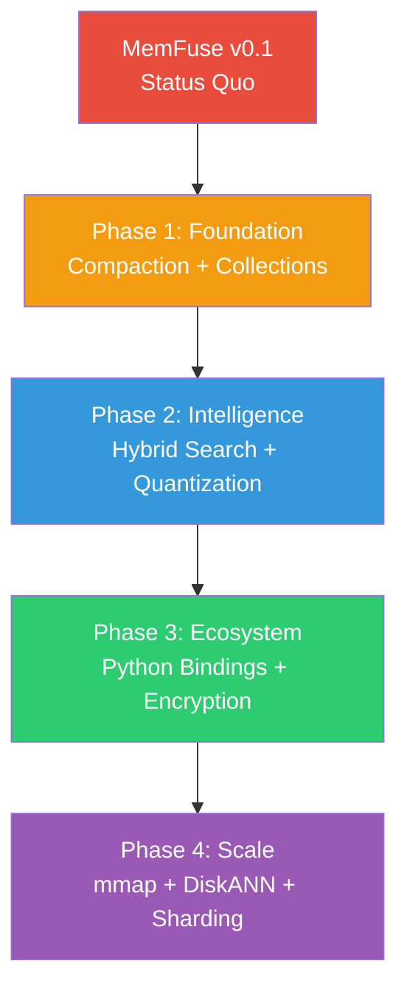
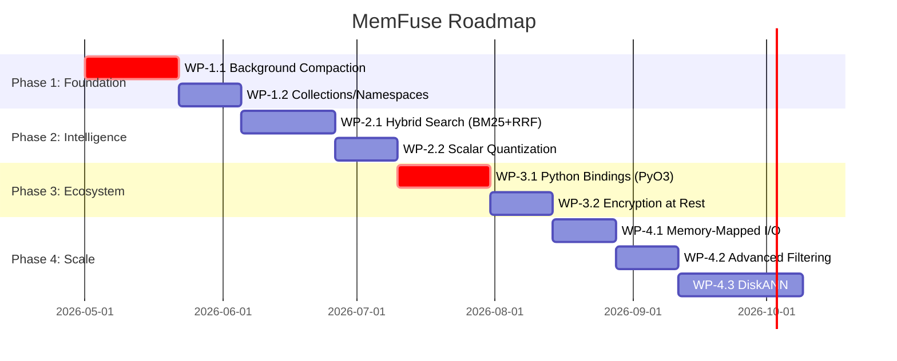

# MemFuse — Strategic Product Roadmap & Implementation Specifications

> **Autor:** Lead Architect  
> **Datum:** 2026-05-05  
> **Scope:** Vom gehärteten MVP zum „SQLite für KI-Agenten"

---

## Executive Summary

MemFuse ist ein **hochperformantes, gehärtetes, eingebettetes Hybrid-Search-System** mit 4 Crates (~4k LoC Rust), das aus ChimeraDB extrahiert wurde. Die technologische Basis (HNSW + LSM-Tree + SIMD + Zero-Panic) ist solide. Um den **Goldstandard** zu erreichen, muss MemFuse vom Spezialisten zum „Schweizer Taschenmesser" werden.

### Architektonische Entscheidung: Fokus auf Stabilität & DX

> [!IMPORTANT]
> **Strategische Priorität:** MemFuse wird NICHT gegen Pinecone (Cloud-Native) positioniert. MemFuse wird das **„SQLite für KI-Agenten"** — lokal, souverän, zero-boilerplate. Jede Architekturentscheidung wird durch dieses Prisma bewertet.

### Status Quo

| Crate | LoC | Zustand | Kernfähigkeit |
|---|---|---|---|
| `memfuse-core` | ~280 | ✅ Stabil | Types, Traits, Error, TxBuffer, Snapshots |
| `memfuse-store` | ~1400 | ⚠️ Feature-Lücken | LSM (MemTable→BTreeMap, WAL+CRC32, SSTable), **keine Compaction** |
| `memfuse-index` | ~1300 | ✅ Stabil | HNSW (AVX2/AVX-512/portable-simd), Diversity-Heuristic, Soft-Delete+Rebuild |
| `memfuse-db` | ~700 | ✅ Stabil | Facade (search, insert, update, delete, relate, scan), 11 Contract-Tests |

---

## Gap-Analyse: Was fehlt zum Goldstandard



| # | Feature | Priorität | Begründung |
|---|---|---|---|
| 1 | **Background Compaction** | 🔴 KRITISCH | SSTables wachsen unbegrenzt → Disk voll, Reads degradieren |
| 2 | **Collections / Namespaces** | 🟠 HOCH | Multi-Tenancy ist minimal viable für jedes Produkt |
| 3 | **Hybrid Search (BM25 + RRF)** | 🟠 HOCH | Marktstandard für RAG; ohne wird MemFuse nicht ernst genommen |
| 4 | **Scalar Quantization (SQ8)** | 🟡 MITTEL | RAM-Reduktion ~4x; ermöglicht Milliarden-Skala |
| 5 | **Python Bindings (PyO3)** | 🟠 HOCH | 90% der KI-Entwickler nutzen Python |
| 6 | **Encryption at Rest** | 🟡 MITTEL | Defense/Sovereign-USP; AES-256-GCM auf SSTable-Ebene |
| 7 | **Advanced Filtering** | 🟡 MITTEL | Pre-Filter vs. Post-Filter Entscheidungslogik |
| 8 | **Memory-Mapped I/O** | 🟡 MITTEL | Datasets > RAM ohne explizites Paging |
| 9 | **State Checkpointing** | 🔵 ZUKUNFT | Agent-State atomar sichern für Time-Travel-Debugging |
| 10 | **Horizontal Sharding** | 🔵 ZUKUNFT | P2P-basiertes Sharding für Edge-Mesh-Netzwerke |

---

## Phase 1: Foundation (Compaction + Collections)

> **Ziel:** MemFuse darf die Festplatte nicht zumüllen und muss mehrere Projekte in einer Instanz unterstützen.

### WP-1.1 — Background Compaction

#### Kontext
Die aktuelle [flush()](file:///home/freddy/Arbeitsplatz/DEV/memfuse/crates/memfuse-store/src/lsm.rs#L268-L306) schreibt MemTable→SSTable, aber SSTables werden **nie zusammengeführt**. Bei langem Betrieb: hunderte kleine Dateien, degradierte Reads, Tombstones werden nie physisch gelöscht.

#### Architektur

```
┌──────────────────────────────────────────────┐
│                 LsmStorage                   │
│                                              │
│  ┌──────────┐   ┌──────────┐   ┌──────────┐ │
│  │ MemTable │──▶│ Immutable│──▶│  Flush   │ │
│  │ (active) │   │ MemTable │   │ to L0    │ │
│  └──────────┘   └──────────┘   └────┬─────┘ │
│                                      │       │
│  ┌───────────────────────────────────▼─────┐ │
│  │          Compaction Engine              │ │
│  │                                         │ │
│  │  L0 (flush output)  ──compaction──▶ L1  │ │
│  │  L1                  ──compaction──▶ L2  │ │
│  │  ...                                    │ │
│  └─────────────────────────────────────────┘ │
└──────────────────────────────────────────────┘
```

#### Spezifikation

##### [NEW] [compaction.rs](file:///home/freddy/Arbeitsplatz/DEV/memfuse/crates/memfuse-store/src/compaction.rs)

```rust
/// Size-Tiered Compaction Strategy (STCS)
/// 
/// Wählt SSTables ähnlicher Größe und merged sie zu einer neuen SSTable.
/// Tombstones werden während des Merges endgültig gelöscht (wenn kein
/// Snapshot sie referenziert).
pub struct CompactionEngine {
    config: CompactionConfig,
    /// Referenz auf SnapshotRegistry um aktive Snapshots zu prüfen
    snapshot_registry: Arc<SnapshotRegistry>,
}

pub struct CompactionConfig {
    /// Minimale Anzahl SSTables gleicher Größenklasse für Compaction-Trigger
    pub min_sstables_per_tier: usize,  // Default: 4
    /// Größenfaktor zwischen Tiers 
    pub size_ratio: f64,               // Default: 4.0
    /// Maximale Anzahl gleichzeitiger Compaction-Tasks
    pub max_concurrent_compactions: usize, // Default: 1
    /// Intervall für Background-Checks
    pub check_interval: Duration,       // Default: 30s
}
```

**Algorithmus:**
1. Gruppiere SSTables nach Größenklasse (Faktor `size_ratio`)
2. Wenn eine Gruppe ≥ `min_sstables_per_tier` hat → merge
3. Merge: Multi-Way-Merge über sortierte Iteratoren aller Input-SSTables
4. Tombstone-GC: Lösche Tombstones nur wenn `seq_no < min_active_snapshot_seq`
5. Ersetze die Input-SSTables atomar (rename + update LsmState)
6. Lösche alte SSTable-Dateien

**Background-Task:**
```rust
impl CompactionEngine {
    /// Startet den Background-Compaction-Loop.
    /// Wird von LsmStorage::new() via tokio::spawn gestartet.
    pub async fn run_loop(
        self: Arc<Self>,
        state: Arc<RwLock<LsmState>>,
        config: LsmConfig,
    ) {
        loop {
            tokio::time::sleep(self.config.check_interval).await;
            if let Err(e) = self.maybe_compact(&state, &config).await {
                tracing::error!("Compaction failed: {}", e);
            }
        }
    }
}
```

##### [MODIFY] [lsm.rs](file:///home/freddy/Arbeitsplatz/DEV/memfuse/crates/memfuse-store/src/lsm.rs)

- Erweitere [LsmStorage](file:///home/freddy/Arbeitsplatz/DEV/memfuse/crates/memfuse-store/src/lsm.rs#51-59) um `compaction_engine: Arc<CompactionEngine>`
- Starte Background-Compaction-Task in `LsmStorage::new()`
- Erweitere [LsmConfig](file:///home/freddy/Arbeitsplatz/DEV/memfuse/crates/memfuse-store/src/lsm.rs#25-31) um `CompactionConfig`
- Füge `pub mod compaction;` in [lib.rs](file:///home/freddy/Arbeitsplatz/DEV/memfuse/crates/memfuse-store/src/lib.rs) hinzu

##### [MODIFY] [sstable.rs](file:///home/freddy/Arbeitsplatz/DEV/memfuse/crates/memfuse-store/src/sstable.rs)

- Füge `SstableReader::iter()` → sortierter Iterator über alle Entries hinzu
- Wird für den Multi-Way-Merge benötigt

---

### WP-1.2 — Collections / Namespaces

#### Kontext
Aktuell gibt es keine Isolation zwischen verschiedenen Datensätzen. Ein Agent, der mehrere Projekte verwaltet, braucht logische Trennung.

#### Architektur

```
MemFuse::open("./data")
  └── collection("documents")  → eigener HNSW + eigener Key-Prefix
  └── collection("memories")   → eigener HNSW + eigener Key-Prefix
  └── collection("tasks")      → eigener HNSW + eigener Key-Prefix
```

#### Spezifikation

##### [NEW] [collection.rs](file:///home/freddy/Arbeitsplatz/DEV/memfuse/crates/memfuse-db/src/collection.rs)

```rust
/// Eine logisch isolierte Sammlung von Dokumenten.
/// 
/// Jede Collection hat:
/// - Eigenen HNSW-Index (eigene Dimension, eigene Metrik)
/// - Einen Key-Prefix im gemeinsamen LSM-Store
/// - Eigene insert/search/delete Methoden
pub struct Collection {
    name: String,
    prefix: Vec<u8>,        // b"__col:{name}:"
    index: Arc<HnswIndex>,
    storage: Arc<LsmStorage>,
    dimension: usize,
    next_tx: Arc<AtomicU64>,
}
```

##### [MODIFY] [lib.rs](file:///home/freddy/Arbeitsplatz/DEV/memfuse/crates/memfuse-db/src/lib.rs)

```rust
impl MemFuse {
    /// Erstellt oder öffnet eine benannte Collection.
    pub async fn collection(&self, name: &str) -> Result<Collection> { ... }
    
    /// Listet alle existierenden Collections auf.
    pub async fn list_collections(&self) -> Result<Vec<String>> { ... }
    
    /// Löscht eine Collection und alle zugehörigen Daten.
    pub async fn drop_collection(&self, name: &str) -> Result<()> { ... }
}
```

**Abwärtskompatibilität:** Die bestehenden `insert/search/delete` Methoden auf [MemFuse](file:///home/freddy/Arbeitsplatz/DEV/memfuse/crates/memfuse-db/src/lib.rs#106-112) operieren auf einer impliziten `"default"` Collection.

---

## Phase 2: Intelligence (Hybrid Search + Quantization)

> **Ziel:** MemFuse wird zum echten RAG-Backend mit Full-Text + Vector + Fusion.

### WP-2.1 — Hybrid Search (BM25 + Reciprocal Rank Fusion)

#### Kontext
Für echtes RAG reicht HNSW allein nicht. Der Goldstandard kombiniert:
- **Dense Vectors** (HNSW, semantische Ähnlichkeit)
- **Sparse Vectors / BM25** (Keyword-Matching, exakte Begriffe)
- **Fusion** via RRF: `RRF_score(d) = Σ 1/(k + rank_r(d))`

#### Architektur

```
┌─────────────────────────────────────┐
│          Hybrid Search              │
│                                     │
│  Query ──┬──▶ HNSW Search ──┐      │
│          │                   ├──▶ RRF Fusion ──▶ Results
│          └──▶ BM25 Search ──┘      │
│                                     │
└─────────────────────────────────────┘
```

#### Spezifikation

##### [NEW] Crate: `memfuse-text`

```
crates/memfuse-text/
├── Cargo.toml
└── src/
    ├── lib.rs
    ├── tokenizer.rs    # Whitespace + Unicode-aware Tokenizer
    ├── inverted.rs     # Inverted Index (term → posting list)
    └── bm25.rs         # BM25 Scoring
```

**Warum eigenes Crate statt Tantivy?**
- Tantivy = +30MB Binary, riesiger Dependency-Graph
- MemFuse braucht einen minimalen Inverted Index (~500 LoC)
- Sovereign-Doktrin: keine ungeprüften externen Dependencies

```rust
// crates/memfuse-text/src/inverted.rs

/// Inverted Index backed by MemFuse's LSM-Store.
/// 
/// Speichert posting lists als Key-Value Paare:
///   Key: __idx:{collection}:{term}
///   Value: bincode-serialisierte RoaringTreemap (DocId-Set)
pub struct InvertedIndex {
    storage: Arc<LsmStorage>,
    prefix: Vec<u8>,
}

impl InvertedIndex {
    /// Indiziert ein Dokument: tokenisiert Text, updated posting lists.
    pub async fn index_document(&self, doc_id: DocId, text: &str, tx: TxId) -> Result<()>;
    
    /// BM25 Scoring über alle Terme der Query.
    pub async fn search_bm25(&self, query: &str, k: usize) -> Result<Vec<ScoredDocument>>;
}
```

##### [NEW] [fusion.rs](file:///home/freddy/Arbeitsplatz/DEV/memfuse/crates/memfuse-db/src/fusion.rs)

```rust
/// Reciprocal Rank Fusion (RRF)
pub fn reciprocal_rank_fusion(
    result_sets: &[Vec<ScoredDocument>],
    k: usize,    // RRF parameter, typisch 60
    limit: usize,
) -> Vec<ScoredDocument> {
    // 1. Für jedes result_set: rank jedes Dokument (1-indexed)
    // 2. Für jedes Dokument: score = Σ 1/(k + rank)
    // 3. Sortiere nach score absteigend, return Top-limit
}
```

##### [MODIFY] [lib.rs](file:///home/freddy/Arbeitsplatz/DEV/memfuse/crates/memfuse-db/src/lib.rs)

```rust
impl MemFuse {
    /// Hybrid search: kombiniert Vektor-Suche und Keyword-Suche via RRF.
    pub async fn hybrid_search(
        &self,
        query_text: &str,
        query_vector: &[f32],
        k: usize,
    ) -> Result<Vec<SearchResult>>;
}
```

---

### WP-2.2 — Scalar Quantization (SQ8)

#### Kontext
1M Vektoren × 1536 Dimensionen × 4 Bytes = **~5.7 GB RAM**. Mit SQ8 (f32→u8): **~1.4 GB**. ~4× Reduktion.

#### Spezifikation

##### [NEW] [quantize.rs](file:///home/freddy/Arbeitsplatz/DEV/memfuse/crates/memfuse-index/src/quantize.rs)

```rust
/// Scalar Quantization: f32 → u8 mit linearer Skalierung.
/// 
/// Jede Dimension wird unabhängig auf [0, 255] skaliert basierend
/// auf dem beobachteten Min/Max Bereich.
pub struct ScalarQuantizer {
    /// Min-Wert pro Dimension
    mins: Vec<f32>,
    /// Max-Wert pro Dimension  
    maxs: Vec<f32>,
    dimension: usize,
}

impl ScalarQuantizer {
    /// Trainiert den Quantizer auf einem Sample der Daten.
    pub fn train(vectors: &[&[f32]], dimension: usize) -> Self;
    
    /// Quantisiert einen f32-Vektor zu u8.
    pub fn quantize(&self, vector: &[f32]) -> Vec<u8>;
    
    /// Berechnet approximative Distanz direkt auf quantisierten Vektoren.
    /// Nutzt SIMD für u8×u8 Dot-Product.
    pub fn distance_quantized(&self, a: &[u8], b: &[u8], metric: DistanceMetric) -> f32;
}
```

**Integration in HNSW:**
- Optionaler `quantizer: Option<ScalarQuantizer>` in [HnswConfig](file:///home/freddy/Arbeitsplatz/DEV/memfuse/crates/memfuse-index/src/hnsw.rs#25-41)
- Graph-Traversal nutzt quantisierte Distanz (schnell, approximativ)
- Re-Ranking der Top-K mit exakten f32-Vektoren (Genauigkeit)
- Zwei-Phasen-Suche: `search_quantized()` → `rerank_exact()`

---

## Phase 3: Ecosystem (Python Bindings + Encryption)

> **Ziel:** MemFuse wird für 90% der KI-Entwickler nutzbar und für Defense-Kunden zertifizierbar.

### WP-3.1 — Python Bindings (PyO3)

#### Spezifikation

##### [NEW] Crate: `memfuse-py`

```
crates/memfuse-py/
├── Cargo.toml       # pyo3, maturin
├── pyproject.toml   # maturin build config
└── src/
    └── lib.rs       # PyO3 wrapper
```

**API-Design (Python):**
```python
import memfuse

# Öffnen
db = memfuse.open("./my_data")

# Collection
col = db.collection("documents", dimension=1536)

# Insert
col.insert("doc-1", embedding=[0.1, 0.2, ...], metadata={"topic": "rust"})

# Search
results = col.search([0.1, 0.2, ...], k=5)

# Hybrid Search
results = col.hybrid_search("rust programming", [0.1, 0.2, ...], k=5)

# Relations
col.relate("doc-1", "doc-2", "references")
edges = col.scan_prefix("__rel:doc-1:")
```

**Technische Details:**
- `maturin` als Build-System
- Async Runtime: `pyo3-asyncio` mit eigenem Tokio-Runtime
- Numpy-Integration: `numpy` crate für zero-copy Vektor-Übergabe
- Distribution: `pip install memfuse` via PyPI (manylinux wheels)

---

### WP-3.2 — Encryption at Rest (AES-256-GCM)

#### Kontext
Sovereign-USP: Daten auf der Platte dürfen nicht im Klartext liegen. Essentiell für Defense, Medizin, Behörden.

#### Spezifikation

##### [NEW] [crypto.rs](file:///home/freddy/Arbeitsplatz/DEV/memfuse/crates/memfuse-store/src/crypto.rs)

```rust
/// Encryption Layer für SSTable Blocks und WAL Entries.
/// 
/// - Algorithmus: AES-256-GCM (AEAD)
/// - Key-Derivation: HKDF-SHA256 aus User-Passphrase
/// - Jeder Block bekommt eine unique Nonce (Counter-basiert)
pub struct CryptoProvider {
    cipher: aes_gcm::Aes256Gcm,
    nonce_counter: AtomicU64,
}

impl CryptoProvider {
    pub fn from_passphrase(passphrase: &str, salt: &[u8]) -> Result<Self>;
    pub fn encrypt_block(&self, plaintext: &[u8]) -> Result<Vec<u8>>;
    pub fn decrypt_block(&self, ciphertext: &[u8]) -> Result<Vec<u8>>;
}
```

**Integration:**
- `SstableBuilder::create_encrypted(path, crypto)` 
- `SstableReader::open_encrypted(path, crypto)`
- `Wal::open_encrypted(path, crypto)`
- `LsmConfig::encryption_key: Option<String>`

---

## Phase 4: Scale (mmap + DiskANN + Advanced Filtering)

> **Ziel:** MemFuse skaliert über RAM-Grenzen hinaus und optimiert Queries intelligent.

### WP-4.1 — Memory-Mapped I/O (mmap)

- SSTable Reads über `mmap` statt explizite `read()`
- HNSW-Graph optional als mmap'd File (für Datasets > RAM)
- Nutzt OS Page-Cache für intelligentes Paging
- Crate: `memmap2` (well-maintained, zero-unsafe wrapper)

### WP-4.2 — Advanced Filtering (Pre vs. Post)

```rust
/// Entscheidet automatisch zwischen Pre- und Post-Filtering:
/// - selectivity > 0.5 → Post-Filter (HNSW-Traversal + Filter)
/// - selectivity < 0.1 → Pre-Filter (Metadaten-Index → Candidate Set → Brute-Force)
/// - 0.1..0.5 → Hybride Strategie
pub struct FilterOptimizer {
    pub fn estimate_selectivity(&self, filter: &FilterExpr) -> f64;
    pub fn choose_strategy(&self, selectivity: f64) -> FilterStrategy;
}
```

### WP-4.3 — DiskANN für Out-of-Core Search

- Für Datasets die nicht in RAM passen
- Graph-Struktur auf SSD mit wenigen IOPS pro Query
- Basiert auf Microsoft Research DiskANN Paper
- Eigenimplementierung in Rust (~2k LoC geschätzt)

---

## Implementierungsreihenfolge & Begründung



### Begründung der Reihenfolge

1. **Compaction zuerst** (WP-1.1): Ohne Compaction füllt sich die Festplatte. Kein sinnvolles Produkt ohne dieses Feature. Blockiert alles andere.

2. **Collections** (WP-1.2): Foundation für Multi-Tenancy. Wird von Hybrid Search benötigt (Collection-scoped Inverted Index).

3. **Hybrid Search** (WP-2.1): Differenzierungsmerkmal. Ohne BM25+RRF ist MemFuse für RAG unbrauchbar.

4. **Quantization** (WP-2.2): Ermöglicht den Sprung zu großen Datasets. Technisch unabhängig, aber strategisch nach Hybrid Search.

5. **Python Bindings** (WP-3.1): Größter Business Impact. 90% Markt wird erschlossen. Braucht stabile API (daher nach Phase 1+2).

6. **Encryption** (WP-3.2): Defense-USP. Braucht stabile Storage-Layer (nach Compaction).

---

## Verifikationsplan

### Automatisierte Tests

Jedes Work Package hat eigene Contract-Tests:

```bash
# Alle Tests ausführen
cargo test --workspace

# Spezifisch pro Crate
cargo test -p memfuse-store   # Compaction-Tests
cargo test -p memfuse-db      # Collection + Hybrid Search Tests
cargo test -p memfuse-index   # Quantization-Tests
cargo test -p memfuse-text    # BM25 + Tokenizer Tests

# Python Bindings (nach maturin build)
cd crates/memfuse-py && maturin develop && python -m pytest tests/
```

### Test-Spezifikationen pro Work Package

**WP-1.1 Compaction:**
- Test: 100 kleine SSTables → nach Compaction ≤ 5
- Test: Tombstones werden physisch gelöscht
- Test: Daten sind nach Compaction noch korrekt lesbar
- Test: Concurrent reads während Compaction funktionieren

**WP-1.2 Collections:**
- Test: Zwei Collections mit gleichen Keys → isoliert
- Test: Collection-Drop löscht alle zugehörigen Daten
- Test: Default-Collection Abwärtskompatibilität

**WP-2.1 Hybrid Search:**
- Test: BM25 rankt exakte Keyword-Matches höher
- Test: RRF kombiniert Vector + BM25 korrekt
- Test: hybrid_search mit leerer Text-Query → nur Vector-Ergebnisse

**WP-2.2 Quantization:**
- Test: Recall@10 ≥ 95% im Vergleich zu exakter Suche
- Test: RAM-Verbrauch sinkt um Faktor ≥ 3
- Benchmark: `cargo bench` auf 100k random Vektoren (dim=1536)

### Bestehende Tests (verifiziert)

Die bestehenden 11 Tests in [memfuse-db](file:///home/freddy/Arbeitsplatz/DEV/memfuse/crates/memfuse-db/src/lib.rs#L490-L703) und je 6-8 Tests in den anderen Crates dienen als **Regressions-Guard**. Jedes WP muss sicherstellen, dass `cargo test --workspace` weiterhin grün ist.

```bash
# Aktueller Test-Status prüfen (vor jedem WP-Start)
cargo test --workspace 2>&1 | tail -5
```

---

## Architektur-Constraints für alle Entwickler

> [!CAUTION]
> Diese Regeln gelten für **alle** Coding Agents, die an MemFuse arbeiten:

1. **`#![forbid(unsafe_code)]`** in jedem Crate (außer SIMD-Funktionen in [distance.rs](file:///home/freddy/Arbeitsplatz/DEV/memfuse/crates/memfuse-index/src/distance.rs))
2. **Zero `.unwrap()`** in Hot-Paths — nur `?` oder explizites Error-Handling
3. **Zero external Runtime-Dependencies** die nicht in `Cargo.toml` gelistet sind
4. **Jede neue Public API** braucht mindestens einen Contract-Test
5. **Jede Datei** braucht ein `//!` Doc-Comment im Header
6. **Alle neuen Structs** brauchen `#[derive(Debug)]`
7. **Backward Compatibility:** Bestehende API-Signaturen dürfen nicht gebrochen werden

---

## Nächster konkreter Schritt

> [!IMPORTANT]
> **Empfehlung:** Starte mit **WP-1.1 Background Compaction**. Ein Entwickler-Agent bekommt dieses WP als eigenständige Aufgabe mit den obigen Spezifikationen. Nach erfolgreichem Abschluss (Tests grün) → WP-1.2.
