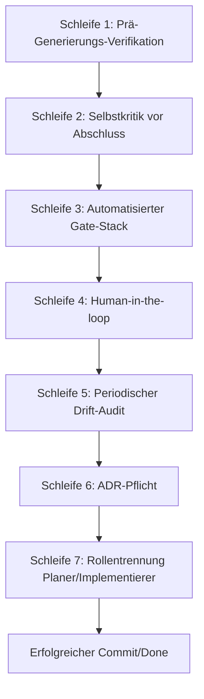

# Vendor-Agnostisches LLM-Entwicklungs- & Härtungsprotokoll
> Referenziert aus `AGENTS.md`. Dieses Protokoll ist für ALLE AI-Systeme absolut bindend.

---

## 1. Das Sieben-Schleifen-Ausführungsprotokoll (Verification Loop Stack)

Jede Codeänderung MUSS diese sieben sequenziellen Schleifen durchlaufen. Wird eine Schleife übersprungen, gilt die Arbeit als fehlerhaft.



---

## 2. Die sieben Schleifen im Detail

### Schleife 1: Prä-Generierungs-Verifikation (Read-Before-Write)
*   **API-Halluzinations-Schutz**: Bevor eine Methode, ein Struct, eine Funktion oder ein Crate-Export verwendet wird, muss der Pfad der API geöffnet und die exakte Signatur gelesen werden.
*   **Lockfile-Abgleich**: Die Version des Crates ist in `Cargo.lock` nachzuschlagen. Keine Versionen oder API-Strukturen aus dem Trainingsdaten-Wissen des LLM annehmen.

### Schleife 2: Selbstkritik vor Abschlussmeldung
*   **Diff-Review**: Bevor die Arbeit als abgeschlossen gemeldet wird, prüft der Agent den eigenen Diff gegen die `AGENTS.md`-Regeln (Boundary-Tiers, Tabus, Konventionen).
*   **Silent-Failure-Review**: Sicherstellen, dass keine Fehler stumm verschluckt werden (z. B. leere `catch`-Blöcke oder ungeprüfte standardmäßige Fallbacks bei Deserialisierung).

### Schleife 3: Automatisierter Gate-Stack
*   **Statische Analyse**: Code-Formatierung prüfen und Compiler/Linter-Warnungen als Fehler behandeln (`just check` ausführen).
*   **Test Gate**: Gesamte Testsuite ausführen (`just test` bzw. `just triple-test` bei Concurrency).
*   **Mutation-Gedankenexperiment**: Würde die Umkehrung eines Operators (< zu <=, + zu -) im geänderten Code mindestens einen Test brechen? Falls nein, ist die Testabdeckung ungenügend.
*   **Secret-Scan**: Überprüfung, dass keine Passwörter, API-Keys oder private Keys im Diff enthalten sind.

### Schleife 4: Human-in-the-loop-Checkpoints
*   **Ask-first-Verhalten**: Bei Aktionen, die als `ASK-FIRST` in `AGENTS.md` klassifiziert sind, muss der Agent die Ausführung pausieren und die explizite Freigabe des Benutzers einholen. Kein "impliziter Konsens".

### Schleife 5: Periodischer Drift-Audit
*   **Regel-vs-Code-Audit**: Regelmäßiger Abgleich, ob die in `AGENTS.md` und `rules/*.md` festgelegten Regeln noch dem tatsächlichen Stand des Codes und den Abhängigkeiten entsprechen.
*   **Sofort-Auslöser**: Jedes Major-Bump einer Abhängigkeit, jede Toolchain-Änderung und jede neue Crate lösen einen sofortigen Drift-Audit aus.

### Schleife 6: ADR-Pflicht
*   **ADR in DECISIONS.md**: Jede nicht-triviale Architekturentscheidung muss in `DECISIONS.md` dokumentiert werden (mit Datum, Status, Alternativen, Begründung), bevor mit der Umsetzung begonnen wird. Dies verhindert wiederholte Diskussionen oder Fehlklassifizierungen bewusster Abweichungen.

### Schleife 7: Rollentrennung Planer/Implementierer
*   **Phasen-Trennung**: Planung, Code-Generierung und Validierung sind strikt getrennt.
    1.  **Planer**: Dokumentiert nicht-triviale Entscheidungen in `DECISIONS.md` (ADR) und wartet auf Genehmigung.
    2.  **Implementierer**: Arbeitet den priorisierten Backlog aus `docs/SOURCE_OF_TRUTH.md` ab.
    3.  **Verifizierer**: Führt `just triple-test` aus und aktualisiert den Status in `docs/SOURCE_OF_TRUTH.md`.

---

## 3. Das AI-TAG Härtungs-Protokoll (Anti-Drift)
Kann ein identifiziertes Risiko oder ein Architektur-Drift nicht sofort behoben werden, MUSS ein Inline-Tag hinterlassen werden:
```rust
// AI-TAG[KATEGORIE][SEVERITY] Kurzbeschreibung des Problems
// BEFUND: Detaillierte Analyse des Ist-Zustands im Code.
// RISIKO: Was passiert bei Last, Ausfall oder Edge Cases?
// EMPFEHLUNG: Konkreter Vorschlag für die Behebung.
// TODO[STABILIZE]: Priorität, Modul/Crate, Ziel-Strang.
// ID: AGT-<Zahl>
```
*   **Kategorien**: `HALLUCINATION` | `DUPLICATION` | `TEST-MIRRORING` | `DEPENDENCY` | `SPEC-DRIFT` | `CONTEXT-GAP` | `BOUNDARY-MISSING` | `CONVENTION-DRIFT` | `CONCURRENCY` | `PANIC-SAFETY` | `SMELL`.
*   **Severities**: `BLOCKER` | `CRITICAL` | `MAJOR` | `MINOR`.

---

## 4. Prompt-Thrashing & Eskalation
Wenn nach zwei Iterationen derselbe Fehler oder Compiler-Fehlermeldung nicht behoben werden kann:
1.  **Stop & Report**: Codeänderungen stoppen (kein Vibe Coding).
2.  **Fehler-Isolation**: Den Fehler auf ein minimales Beispiel reduzieren.
3.  **Eskalation**: Dem Entwickler die Situation präsentieren und um präzise Instruktionen bitten.
